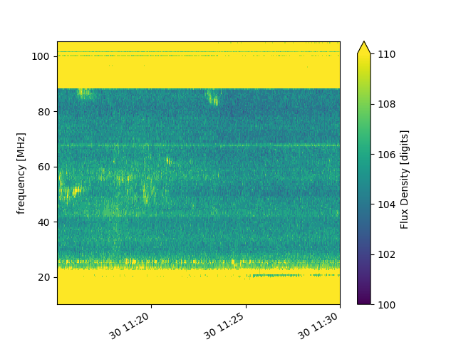

Dataset Reference
=================

+-------------------+------------+------------------------------------------------------------------------+--------+-------------+
| Facility          | Instrument | Dataset                                                                | Format | Data Center |
+===================+============+========================================================================+========+=============+
| Birr              | E-Callisto | :ref:`ecallisto <ecallisto>`                                           | FITS   | E-Callisto  |
+-------------------+------------+------------------------------------------------------------------------+--------+-------------+
| Interball-Auroral | POLRAD     | :ref:`cdpp_int_aur_polrad_rspn2 <cdpp_int_aur_polrad_rspn2>`           | Binary | CDPP        |
+-------------------+------------+------------------------------------------------------------------------+--------+-------------+
| Juno              | Waves      | :ref:`jno_wav_cdr_lesia <jno_wav_cdr_lesia>`                           | CDF    | PADC        |
+-------------------+------------+------------------------------------------------------------------------+--------+-------------+
| Mars-Express      | MARSIS     | :ref:`MEX-M-MARSIS-3-RDR-AIS-V1.0 <MEX-M-MARSIS-3-RDR-AIS-V1.0>`       | PDS3   | PSA         |
+-------------------+------------+------------------------------------------------------------------------+--------+-------------+
| Mars-Express      | MARSIS     | :ref:`MEX-M-MARSIS-3-RDR-AIS-EXT1-V1.0 <MEX-M-MARSIS-3-RDR-AIS-V1.0>`  | PDS3   | PSA         |
+-------------------+------------+------------------------------------------------------------------------+--------+-------------+
| Mars-Express      | MARSIS     | :ref:`MEX-M-MARSIS-3-RDR-AIS-EXT2-V1.0 <MEX-M-MARSIS-3-RDR-AIS-V1.0>`  | PDS3   | PSA         |
+-------------------+------------+------------------------------------------------------------------------+--------+-------------+
| Mars-Express      | MARSIS     | :ref:`MEX-M-MARSIS-3-RDR-AIS-EXT3-V1.0 <MEX-M-MARSIS-3-RDR-AIS-V1.0>`  | PDS3   | PSA         |
+-------------------+------------+------------------------------------------------------------------------+--------+-------------+
| Mars-Express      | MARSIS     | :ref:`MEX-M-MARSIS-3-RDR-AIS-EXT4-V1.0 <MEX-M-MARSIS-3-RDR-AIS-V1.0>`  | PDS3   | PSA         |
+-------------------+------------+------------------------------------------------------------------------+--------+-------------+
| Mars-Express      | MARSIS     | :ref:`MEX-M-MARSIS-3-RDR-AIS-EXT5-V1.0 <MEX-M-MARSIS-3-RDR-AIS-V1.0>`  | PDS3   | PSA         |
+-------------------+------------+------------------------------------------------------------------------+--------+-------------+
| Mars-Express      | MARSIS     | :ref:`MEX-M-MARSIS-3-RDR-AIS-EXT6-V1.0 <MEX-M-MARSIS-3-RDR-AIS-V1.0>`  | PDS3   | PSA         |
+-------------------+------------+------------------------------------------------------------------------+--------+-------------+
| NDA               | Routine    | :ref:`srn_nda_routine_jup_edr <Msrn_nda_routine_jup_edr>`              | CDF    | CDN         |
+-------------------+------------+------------------------------------------------------------------------+--------+-------------+
| Wind              | Waves      | :ref:`cdpp_wi_wa_rad1_l2_60s_v1 <cdpp_wi_wa_rad1_l2_60s_v1>`           | Binary | CDPP        |
+-------------------+------------+------------------------------------------------------------------------+--------+-------------+
| Wind              | Waves      | :ref:`cdpp_wi_wa_rad1_l2_60s_v2 <cdpp_wi_wa_rad1_l2_60s_v2>`           | Binary | CDPP        |
+-------------------+------------+------------------------------------------------------------------------+--------+-------------+
| Wind              | Waves      | :ref:`cdpp_wi_wa_rad2_l2_60s_v1 <cdpp_wi_wa_rad2_l2_60s_v1>`           | Binary | CDPP        |
+-------------------+------------+------------------------------------------------------------------------+--------+-------------+
| Wind              | Waves      | :ref:`cdpp_wi_wa_rad2_l2_60s_v2 <cdpp_wi_wa_rad2_l2_60s_v2>`           | Binary | CDPP        |
+-------------------+------------+------------------------------------------------------------------------+--------+-------------+
| Wind              | Waves      | :ref:`cdpp_wi_wa_tnr_l2_60s_v1 <cdpp_wi_wa_tnr_l2_60s_v1>`             | Binary | CDPP        |
+-------------------+------------+------------------------------------------------------------------------+--------+-------------+
| Wind              | Waves      | :ref:`cdpp_wi_wa_tnr_l2_60s_v2 <cdpp_wi_wa_tnr_l2_60s_v2>`             | Binary | CDPP        |
+-------------------+------------+------------------------------------------------------------------------+--------+-------------+

Interball-Auroral / POLRAD
--------------------------

All descriptions in this section are adapted from the `CDPP Data Archive portal <https://cdpp-archive.cnes.fr>`_.

The POLRAD instrument onboard the INTERBALL Auroral Probe is a radio-spectro-polarimeter aimed to
provide measurements of the auroral kilometric radiation (AKR) and plasma waves generated in the
Earth auroral regions from the orbit of the Interball Auroral Probe (Interball-2). Its scientific
objectives include studies of:

* AKR generation from sources associated with the field-aligned acceleration regions in the auroral
  magnetosphere,
* modes of AKR emission inferred from measurements of the Stokes parameters of the wave polarisation,
* direction finding and directivity of the AKR emission.

POLRAD is a step-frequency analyser (SFA) aimed at measuring intensity of the AKR and its polarization
parameters in the frequency range selected between 4 kHz and 2 MHz with a frequency resolution of
4.096 kHz. The detailed list of the instrumental characteristics are given in Table 1. Three orthogonal
antennae are used to detect wave electric fields: two 22 m long (tip-to-tip) dipoles perpendicular to
the spin axis of the spacecraft (Y and Z antennae) and one monopole 11 m long (center of the s/c to tip)
deployed along it in antisolar direction (X antenna).

.. _cdpp_int_aur_polrad_rspn2:

cdpp_int_aur_polrad_rspn2
.........................

* **Data Centre**: CNES/CDPP

The RSPN2 (*Radio Spectrograms Level 2*) dataset consist of receiver frequency sweeps, containing power
intensities of radio emission at consecutive frequency steps staring from the highest and ending on
the lowest (which is always 4 kHz), and information on the instrument status.

.. code-block:: python

   from maser.data import Data
   from matplotlib import pyplot as plt
   data = Data("tests/data/cdpp/interball/POLR_RSPN2_19990126")
   data.as_xarray()["EX"].plot(vmin=1e-20, vmax=1e-18)
   plt.show()

.. image:: figures/cdpp_int_aur_polrad_rspn2.png
   :width: 400
   :alt: cdpp_int_aur_polrad_rspn2 example plot

WIND/Waves
----------

The WAVES experiment exploits instrumentation developed jointly by the Observatoire de Paris, the
University of Minnesota, and the Goddard Space Flight Center. The Radio and Plasma WAVES investigation
on the WIND spacecraft provides comprehensive coverage of radio and plasma wave phenomena in the frequency
range from a fraction of a Hertz up to about 14 MHz for the electric field and 3 kHz for the magnetic field.
This package permits several kinds of measurements all of which are essential to understanding the Earth's
environment - the Geospace - and its response to varying solar wind conditions. In situ measurements of
different modes of plasma waves give information on local processes and couplings in different regions and
boundaries of the Geospace leading to plasma instabilities: magneto-acoustic waves, ion cyclotron waves,
whistler waves, electron plasma oscillations, electron burst noise and other types of electrostatic or
electromagnetic waves.

The sensors are:

* three electric dipolar antenna systems supplied by Fairchild Space (two are coplanar, orthogonal wire
  dipole antennas in the spin-plane, the other a rigid spin-axis dipole);
* three magnetic search coils mounted orthogonally (designed and built by the University of Iowa).

.. _cdpp_wi_wa_rad1_l2_60s_v1:

cdpp_wi_wa_rad1_l2_60s_v1
.........................

* **Data Centre**: CNES/CDPP

.. code-block:: python

   from maser.data import Data
   data = Data("tests/data/cdpp/wind/wi_wa_rad1_l2_60s_19941114_v01.dat")

.. _cdpp_wi_wa_rad1_l2_60s_v2:

cdpp_wi_wa_rad1_l2_60s_v2
.........................

* **Data Centre**: CNES/CDPP

.. code-block:: python

   from maser.data import Data
   data = Data("tests/data/cdpp/wind/WIN_RAD1_60S_19941114.B3E")

.. _cdpp_wi_wa_rad2_l2_60s_v1:

cdpp_wi_wa_rad2_l2_60s_v1
.........................

* **Data Centre**: CNES/CDPP

.. code-block:: python

   from maser.data import Data
   data = Data("tests/data/cdpp/wind/wi_wa_rad2_l2_60s_19941114_v01.dat")

.. _cdpp_wi_wa_rad2_l2_60s_v2:

cdpp_wi_wa_rad2_l2_60s_v2
.........................

* **Data Centre**: CNES/CDPP

.. code-block:: python

   from maser.data import Data
   data = Data("tests/data/cdpp/wind/WIN_RAD2_60S_19941114.B3E")

.. _cdpp_wi_wa_tnr_l2_60s_v1:

cdpp_wi_wa_tnr_l2_60s_v1
.........................

* **Data Centre**: CNES/CDPP

.. code-block:: python

   from maser.data import Data
   data = Data("tests/data/cdpp/wind/wi_wa_tnr_l2_60s_19941114_v01.dat")

.. _cdpp_wi_wa_tnr_l2_60s_v2:

cdpp_wi_wa_tnr_l2_60s_v2
.........................

* **Data Centre**: CNES/CDPP

.. code-block:: python

   from maser.data import Data
   data = Data("tests/data/cdpp/wind/WIN_TNR_60S_19941114.B3E")

.. _cdpp_wi_wa_rad1_l2:

cdpp_wi_wa_rad1_l2
..................

* **Data Centre**: CNES/CDPP

.. code-block:: python

   from maser.data import Data
   data = Data("tests/data/cdpp/wind/wi_wa_rad1_l2_19941110_v01.dat")

Mars-Express / MARSIS
---------------------

.. _MEX-M-MARSIS-3-RDR-AIS-V1.0:

MEX-M-MARSIS-3-RDR-AIS-V1.0
...........................

* **Data Centre**: ESA/PSA

Sub-collections from ESA/PSA archive: ``MEX-M-MARSIS-3-RDR-AIS-V1.0``, ``MEX-M-MARSIS-3-RDR-AIS-EXT1-V1.0``,
``MEX-M-MARSIS-3-RDR-AIS-EXT2-V1.0``, ``MEX-M-MARSIS-3-RDR-AIS-EXT3-V1.0``, ``MEX-M-MARSIS-3-RDR-AIS-EXT4-V1.0``,
``MEX-M-MARSIS-3-RDR-AIS-EXT5-V1.0`` and ``MEX-M-MARSIS-3-RDR-AIS-EXT6-V1.0``.

Juno / Waves
------------

.. _jno_wav_cdr_lesia:

jno_wav_cdr_lesia
.................

* **Data Centre**: ObsParis/PADC

.. code-block:: python

   from maser.data import Data
   import numpy as np
   from matplotlib import pyplot as plt
   data = Data("tests/data/maser/juno/jno_wav_cdr_lesia_20170329_v02.cdf")
   xd = data.as_xarray()
   xd.values = 10 * np.log(xd.values)
   xd.attrs["units"] = f"dB ({xd.attrs['units']})"
   xd.plot(yscale="log")
   plt.show()

.. image:: figures/jno_wav_cdr_lesia.png
   :width: 400
   :alt: jno_wav_cdr_lesia example plot

E-Callisto
----------

.. _ecallisto:

ecallisto
.........

* **Data Centre**: E-Callisto

.. code-block:: python

   from maser.data import Data
   from matplotlib import pyplot as plt
   data = Data("tests/data/e-callisto/BIR/BIR_20220130_111500_01.fit")
   xd = data.as_xarray()
   xd.plot(vmin=100, vmax=110)
   plt.title(xd.attrs['title'])
   plt.show()

Nançay Decameter Array (NDA)
----------------------------

.. _srn_nda_routine_jup_edr:

* **Data Centre**: Centre de Données de Nançay (CDN)

.. code-block:: python

   from maser.data import Data
   from matplotlib import pyplot as plt
   data = Data("tests/data/nda/routine/srn_nda_routine_jup_edr_201601302247_201601310645_V12.cdf")
   xd = data.as_xarray()
   xd.plot(vmin=40, vmax=120)
   plt.title(xd.attrs['title'])
   plt.show()

.. image:: figures/srn_nda_routine_jup_edr.png
   :width: 400
   :alt: NDA Routine example plot
