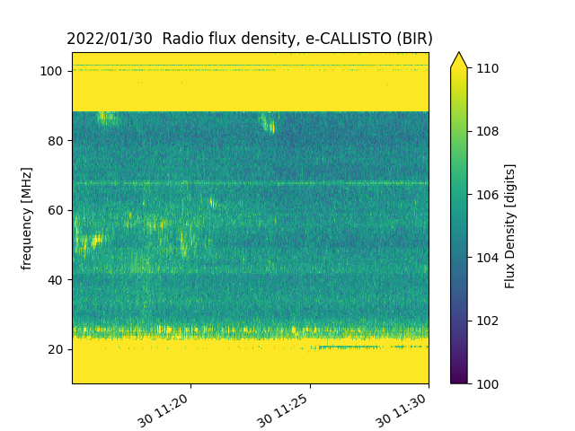
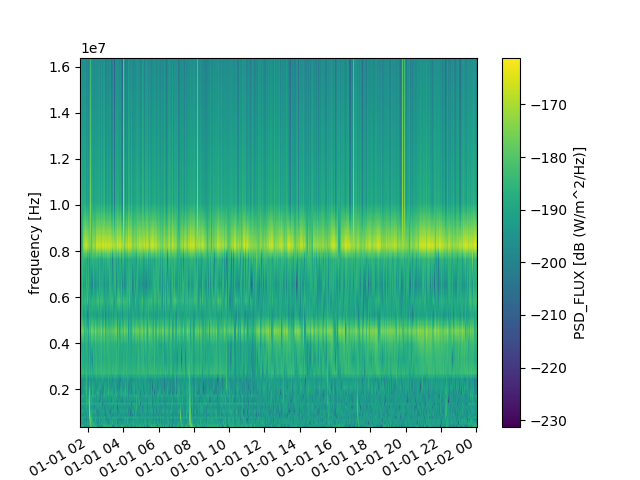
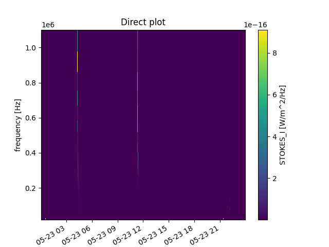
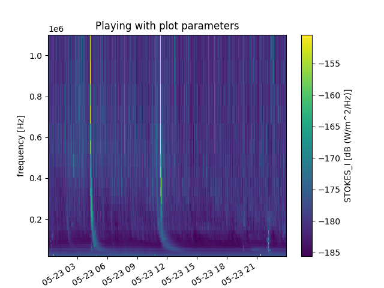
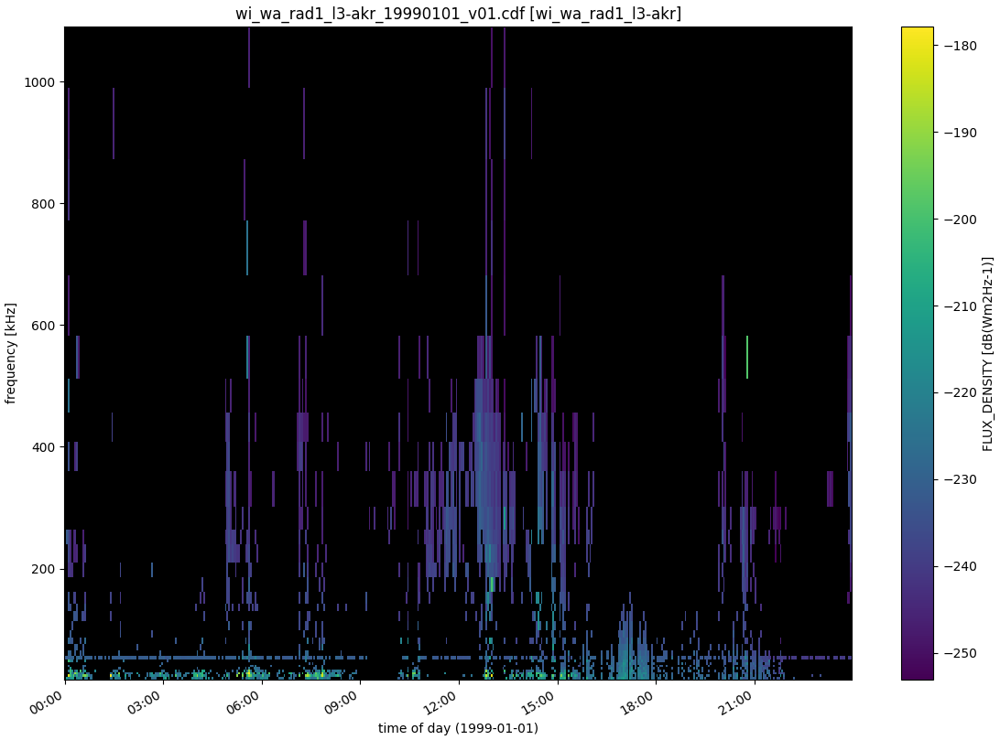
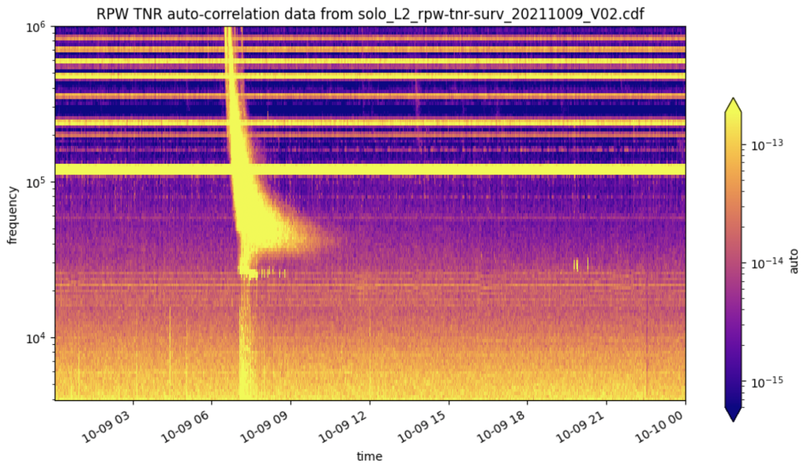

Examples and notebooks
======================

.. _sec_examples_and_notebooks:

The following 3 sections will give examples
for each of the three submodules :ref:`maser-data<tuto_maser_data>`, :ref:`maser-plot<tuto_maser_plot>` and :ref:`maser-tools<tuto_maser_tools>`.
Additionnal tutorial notebooks can also be found in :ref:`notebooks<tuto_notebooks>`.

.. _tuto_maser_data:

maser-data
----------

The examples section for *maser-data* countain 2 subsections of tutorials.
First, the *Dataset Reference* subsection gives short examples with expected output for
every supported dataset; then the :ref:`plotting subsection<tuto_maser_data_plot>` includes general advises and tutorials
for generic usages of *maser-data*.

Dataset Reference
~~~~~~~~~~~~~~~~~~

This section contain a collection of examples for available datasets, with a short description (also available in the :ref:`User Guide<sec_user_guide>` section).
The easiest is to directly use the table below to reach your favorite instrument/dataset.

+-------------------+------------+-----------------------------------------------------------------------------------+--------+-------------+
| Facility          | Instrument | Dataset                                                                           | Format | Data Center |
+===================+============+===================================================================================+========+=============+
| BepiColombo / MMO | PWI/SORBET | :ref:`mmo_pwi_sorbet_l1_ex_specdB-tnr-qtn_ <tuto_sorbet_l1_ex-tnr-qtn_>`          | CDF    | PADC        |
+-------------------+------------+-----------------------------------------------------------------------------------+--------+-------------+
| BepiColombo / MMO | PWI/SORBET | :ref:`mmo_pwi_sorbet_l1_bz-ex_complex-specdB-tnr <tuto_sorbet_l1_bz-ex-tnr>`      | CDF    | PADC        |
+-------------------+------------+-----------------------------------------------------------------------------------+--------+-------------+
| Birr              | E-Callisto | :ref:`ecallisto <tuto_ecallisto>`                                                 | FITS   | E-Callisto  |
+-------------------+------------+-----------------------------------------------------------------------------------+--------+-------------+
| Cassini           | RPWS       | :ref:`co_rpws_hfr_kronos_n1 <tuto_co_rpws_hfr_kronos_n1>`                         | Binary | PADC        |
+-------------------+------------+-----------------------------------------------------------------------------------+--------+-------------+
| Cassini           | RPWS       | :ref:`co_rpws_hfr_kronos_n2 <tuto_co_rpws_hfr_kronos_n2>`                         | Binary | PADC        |
+-------------------+------------+-----------------------------------------------------------------------------------+--------+-------------+
| Cassini           | RPWS       | :ref:`co_rpws_hfr_kronos_n3d <tuto_co_rpws_hfr_kronos_n3d>`                       | Binary | PADC        |
+-------------------+------------+-----------------------------------------------------------------------------------+--------+-------------+
| Cassini           | RPWS       | :ref:`co_rpws_hfr_kronos_n3e <tuto_co_rpws_hfr_kronos_n3e>`                       | Binary | PADC        |
+-------------------+------------+-----------------------------------------------------------------------------------+--------+-------------+
| ExPRES            |            | expres_<observer>_<target>                                                        | CDF    | PADC        |
+-------------------+------------+-----------------------------------------------------------------------------------+--------+-------------+
| Interball-Auroral | POLRAD     | :ref:`cdpp_int_aur_polrad_rspn2 <tuto_cdpp_int_aur_polrad_rspn2>`                 | Binary | CDPP        |
+-------------------+------------+-----------------------------------------------------------------------------------+--------+-------------+
| Juno              | Waves      | :ref:`jno_wav_cdr_lesia <tuto_jno_wav_cdr_lesia>`                                 | CDF    | PADC        |
+-------------------+------------+-----------------------------------------------------------------------------------+--------+-------------+
| Mars-Express      | MARSIS     | :ref:`MEX-M-MARSIS-3-RDR-AIS-V1.0 <tuto_MEX-M-MARSIS-3-RDR-AIS-V1.0>`             | PDS3   | PSA         |
+-------------------+------------+-----------------------------------------------------------------------------------+--------+-------------+
| Mars-Express      | MARSIS     | :ref:`MEX-M-MARSIS-3-RDR-AIS-EXT1-V1.0 <tuto_MEX-M-MARSIS-3-RDR-AIS-V1.0>`        | PDS3   | PSA         |
+-------------------+------------+-----------------------------------------------------------------------------------+--------+-------------+
| Mars-Express      | MARSIS     | :ref:`MEX-M-MARSIS-3-RDR-AIS-EXT2-V1.0 <tuto_MEX-M-MARSIS-3-RDR-AIS-V1.0>`        | PDS3   | PSA         |
+-------------------+------------+-----------------------------------------------------------------------------------+--------+-------------+
| Mars-Express      | MARSIS     | :ref:`MEX-M-MARSIS-3-RDR-AIS-EXT3-V1.0 <tuto_MEX-M-MARSIS-3-RDR-AIS-V1.0>`        | PDS3   | PSA         |
+-------------------+------------+-----------------------------------------------------------------------------------+--------+-------------+
| Mars-Express      | MARSIS     | :ref:`MEX-M-MARSIS-3-RDR-AIS-EXT4-V1.0 <tuto_MEX-M-MARSIS-3-RDR-AIS-V1.0>`        | PDS3   | PSA         |
+-------------------+------------+-----------------------------------------------------------------------------------+--------+-------------+
| Mars-Express      | MARSIS     | :ref:`MEX-M-MARSIS-3-RDR-AIS-EXT5-V1.0 <tuto_MEX-M-MARSIS-3-RDR-AIS-V1.0>`        | PDS3   | PSA         |
+-------------------+------------+-----------------------------------------------------------------------------------+--------+-------------+
| Mars-Express      | MARSIS     | :ref:`MEX-M-MARSIS-3-RDR-AIS-EXT6-V1.0 <tuto_MEX-M-MARSIS-3-RDR-AIS-V1.0>`        | PDS3   | PSA         |
+-------------------+------------+-----------------------------------------------------------------------------------+--------+-------------+
| NDA               | Routine    | :ref:`srn_nda_routine_jup_edr <tuto_srn_nda_routine_jup_edr>`                     | CDF    | CDN         |
+-------------------+------------+-----------------------------------------------------------------------------------+--------+-------------+
| NDA               | Routine    | :ref:`srn_nda_routine_sun_edr <tuto_srn_nda_routine_sun_edr>`                     | CDF    | CDN         |
+-------------------+------------+-----------------------------------------------------------------------------------+--------+-------------+
| NDA               | NewRoutine | :ref:`orn_nda_newroutine_jup_edr <tuto_orn_nda_newroutine_jup_edr>`               | FITS   | CDN         |
+-------------------+------------+-----------------------------------------------------------------------------------+--------+-------------+
| NDA               | NewRoutine | :ref:`orn_nda_newroutine_sun_edr <tuto_orn_nda_newroutine_sun_edr>`               | FITS   | CDN         |
+-------------------+------------+-----------------------------------------------------------------------------------+--------+-------------+
| NDA               | NewRoutine | :ref:`orn_nda_newroutine_transit_edr <tuto_orn_nda_newroutine_transit_edr>`       | FITS   | CDN         |
+-------------------+------------+-----------------------------------------------------------------------------------+--------+-------------+
| NDA               | Mefisto    | :ref:`orn_nda_mefisto_sun_edr <tuto_orn_nda_mefisto_sun_edr>`                     | FITS   | CDN         |
+-------------------+------------+-----------------------------------------------------------------------------------+--------+-------------+
| NDA               | NenuFAR/BST| :ref:`orn_nenufar_bst <tuto_orn_nenufar_bst>`                                     | FITS   | CDN         |
+-------------------+------------+-----------------------------------------------------------------------------------+--------+-------------+
| SolarOrbiter      | RPW        | :ref:`solo_L2_rpw-hfr-surv <tuto_solo_L2_rpw-hfr-surv>`                           | CDF    | PADC        |
+-------------------+------------+-----------------------------------------------------------------------------------+--------+-------------+
| SolarOrbiter      | RPW        | :ref:`solo_L2_rpw-tnr-surv <tuto_solo_L2_rpw-tnr-surv>`                           | CDF    | PADC        |
+-------------------+------------+-----------------------------------------------------------------------------------+--------+-------------+
| SolarOrbiter      | RPW        | :ref:`solo_L2_rpw-lfr-surv-bp1 <tuto_solo_L2_rpw-lfr-surv-bp1>`                   | CDF    | PADC        |
+-------------------+------------+-----------------------------------------------------------------------------------+--------+-------------+
| SolarOrbiter      | RPW        | :ref:`solo_L3_rpw-hfr-flux_ <tuto_solo_L3_rpw-hfr-flux_>`                         | CDF    | PADC        |
+-------------------+------------+-----------------------------------------------------------------------------------+--------+-------------+
| SolarOrbiter      | RPW        | :ref:`solo_L3_rpw-tnr-flux_ <tuto_solo_L3_rpw-tnr-flux_>`                         | CDF    | PADC        |
+-------------------+------------+-----------------------------------------------------------------------------------+--------+-------------+
| STEREO-A          | Waves      | :ref:`sta_l3_wav_lfr <tuto_sta_l3_wav_lfr>`                                       | CDF    | PADC        |
+-------------------+------------+-----------------------------------------------------------------------------------+--------+-------------+
| STEREO-A          | Waves      | :ref:`sta_l3_wav_hfr <tuto_sta_l3_wav_hfr>`                                       | CDF    | PADC        |
+-------------------+------------+-----------------------------------------------------------------------------------+--------+-------------+
| STEREO-B          | Waves      | :ref:`stb_l3_wav_lfr <tuto_stb_l3_wav_lfr>`                                       | CDF    | PADC        |
+-------------------+------------+-----------------------------------------------------------------------------------+--------+-------------+
| STEREO-B          | Waves      | :ref:`stb_l3_wav_hfr <tuto_stb_l3_wav_hfr>`                                       | CDF    | PADC        |
+-------------------+------------+-----------------------------------------------------------------------------------+--------+-------------+
| STEREO-A          | Waves      | :ref:`cdpp_sta_l2_wav_h_res_lfr <tuto_sta_l2_wav_lfr>`                            | Binary | CDPP        |
+-------------------+------------+-----------------------------------------------------------------------------------+--------+-------------+
| STEREO-A          | Waves      | :ref:`cdpp_sta_l2_wav_h_res_hfr <tuto_sta_l2_wav_hfr>`                            | Binary | CDPP        |
+-------------------+------------+-----------------------------------------------------------------------------------+--------+-------------+
| STEREO-B          | Waves      | :ref:`cdpp_stb_l2_wav_h_res_lfr <tuto_stb_l2_wav_lfr>`                            | Binary | CDPP        |
+-------------------+------------+-----------------------------------------------------------------------------------+--------+-------------+
| STEREO-B          | Waves      | :ref:`cdpp_stb_l2_wav_h_res_hfr <tuto_stb_l2_wav_hfr>`                            | Binary | CDPP        |
+-------------------+------------+-----------------------------------------------------------------------------------+--------+-------------+
| Viking            |            | :ref:`cdpp_viking_v4n_e5 <tuto_cdpp_viking_v4n_e5>`                               | Binary | CDPP        |
+-------------------+------------+-----------------------------------------------------------------------------------+--------+-------------+
| Voyager-1         | PRA        | :ref:`VG1-J-PRA-3-RDR-LOWBAND-6SEC-V1.0 <tuto_VG1-J-PRA-3-RDR-LOWBAND-6SEC-V1.0>` | PDS3   | PDS/PPI     |
+-------------------+------------+-----------------------------------------------------------------------------------+--------+-------------+
| Wind              | Waves      | :ref:`cdpp_wi_wa_rad1_l2_60s_v1 <tuto_cdpp_wi_wa_rad1_l2_60s_v1>`                 | Binary | CDPP        |
+-------------------+------------+-----------------------------------------------------------------------------------+--------+-------------+
| Wind              | Waves      | :ref:`cdpp_wi_wa_rad1_l2_60s_v2 <tuto_cdpp_wi_wa_rad1_l2_60s_v2>`                 | Binary | CDPP        |
+-------------------+------------+-----------------------------------------------------------------------------------+--------+-------------+
| Wind              | Waves      | :ref:`cdpp_wi_wa_rad2_l2_60s_v1 <tuto_cdpp_wi_wa_rad2_l2_60s_v1>`                 | Binary | CDPP        |
+-------------------+------------+-----------------------------------------------------------------------------------+--------+-------------+
| Wind              | Waves      | :ref:`cdpp_wi_wa_rad2_l2_60s_v2 <tuto_cdpp_wi_wa_rad2_l2_60s_v2>`                 | Binary | CDPP        |
+-------------------+------------+-----------------------------------------------------------------------------------+--------+-------------+
| Wind              | Waves      | :ref:`cdpp_wi_wa_tnr_l2_60s_v1 <tuto_cdpp_wi_wa_tnr_l2_60s_v1>`                   | Binary | CDPP        |
+-------------------+------------+-----------------------------------------------------------------------------------+--------+-------------+
| Wind              | Waves      | :ref:`cdpp_wi_wa_tnr_l2_60s_v2 <tuto_cdpp_wi_wa_tnr_l2_60s_v2>`                   | Binary | CDPP        |
+-------------------+------------+-----------------------------------------------------------------------------------+--------+-------------+
| Wind              | Waves      | :ref:`wi_wa_rad1_l3-akr <tuto_wi_wa_rad1_l3-akr>`                                 | CDF    | PADC        |
+-------------------+------------+-----------------------------------------------------------------------------------+--------+-------------+
| Wind              | Waves      | :ref:`wi_wav_rad1_l3_df_v02 <tuto_wi_wav_rad1_l3_df_v02>`                         | CDF    | PADC        |
+-------------------+------------+-----------------------------------------------------------------------------------+--------+-------------+

ExPRES
""""""""""""""""""""""""""""""

.. _tuto_EXPRES_dataset:

`ExPRES <https://maser.lesia.obspm.fr/task-2-modeling-tools/expres/?lang=en>`_ (Exoplanetary and Planetary Radio
Emission Simulator) simulations are stored in CDF files. They can be automatically read by `Data`.

A specificity for the ExPRES dataset classes is the additional attribute `source`, which is dataset-dependent.
It can either be specified as an argument (e.g., `Data('<expres_file.cdf>', source='Io NORTH')`) or as an attribute (see the following
example). If set to `None` (by default), the 'extra' dimension is kept.

.. code-block:: python

   from maser.data import Data
   from matplotlib import pyplot as plt
   expres_data = Data(base_dir+'/maser/expres/expres_earth_jupiter_io_jrm09_lossc-wid1deg_3kev_20220801_v01.cdf')
   expres_data.source = 'Io NORTH'
   data = expres_data.as_xarray()
   data['Theta'].plot()
   plt.show()

Interball-Auroral / POLRAD
""""""""""""""""""""""""""""""

All descriptions in this section are adapted from the `CDPP Data Archive portal <https://cdpp-archive.cnes.fr>`_.

The POLRAD instrument onboard the INTERBALL Auroral Probe is a radio-spectro-polarimeter aimed to
provide measurements of the auroral kilometric radiation (AKR) and plasma waves generated in the
Earth auroral regions from the orbit of the Interball Auroral Probe (Interball-2). Its scientific
objectives include studies of:

* AKR generation from sources associated with the field-aligned acceleration regions in the auroral
  magnetosphere,
* modes of AKR emission inferred from measurements of the Stokes parameters of the wave polarisation,
* direction finding and directivity of the AKR emission.

POLRAD is a step-frequency analyser (SFA) aimed at measuring intensity of the AKR and its polarization
parameters in the frequency range selected between 4 kHz and 2 MHz with a frequency resolution of
4.096 kHz. The detailed list of the instrumental characteristics are given in Table 1. Three orthogonal
antennae are used to detect wave electric fields: two 22 m long (tip-to-tip) dipoles perpendicular to
the spin axis of the spacecraft (Y and Z antennae) and one monopole 11 m long (center of the s/c to tip)
deployed along it in antisolar direction (X antenna).

.. _tuto_cdpp_int_aur_polrad_rspn2:

cdpp_int_aur_polrad_rspn2
.........................

* **Data Centre**: CNES/CDPP

The RSPN2 (*Radio Spectrograms Level 2*) dataset consist of receiver frequency sweeps, containing power
intensities of radio emission at consecutive frequency steps staring from the highest and ending on
the lowest (which is always 4 kHz), and information on the instrument status.

.. code-block:: python

   from maser.data import Data
   from matplotlib import pyplot as plt
   data = Data(base_dir+"cdpp/interball/POLR_RSPN2_19990126")
   data.as_xarray()["EX"].plot(vmin=1e-20, vmax=1e-18)
   plt.show()

WIND/Waves
""""""""""""""""""""""""""""""

The WAVES experiment exploits instrumentation developed jointly by the Observatoire de Paris, the
University of Minnesota, and the Goddard Space Flight Center. The Radio and Plasma WAVES investigation
on the WIND spacecraft provides comprehensive coverage of radio and plasma wave phenomena in the frequency
range from a fraction of a Hertz up to about 14 MHz for the electric field and 3 kHz for the magnetic field.
This package permits several kinds of measurements all of which are essential to understanding the Earth's
environment - the Geospace - and its response to varying solar wind conditions. In situ measurements of
different modes of plasma waves give information on local processes and couplings in different regions and
boundaries of the Geospace leading to plasma instabilities: magneto-acoustic waves, ion cyclotron waves,
whistler waves, electron plasma oscillations, electron burst noise and other types of electrostatic or
electromagnetic waves.

The sensors are:

* three electric dipolar antenna systems supplied by Fairchild Space (two are coplanar, orthogonal wire
  dipole antennas in the spin-plane, the other a rigid spin-axis dipole);
* three magnetic search coils mounted orthogonally (designed and built by the University of Iowa).

.. _tuto_cdpp_wi_wa_rad1_l2_60s_v1:

cdpp_wi_wa_rad1_l2_60s_v1
.........................

* **Data Centre**: CNES/CDPP

.. code-block:: python

   from maser.data import Data
   data = Data("tests/data/cdpp/wind/wi_wa_rad1_l2_60s_19941114_v01.dat")

.. _tuto_cdpp_wi_wa_rad1_l2_60s_v2:

cdpp_wi_wa_rad1_l2_60s_v2
.........................

* **Data Centre**: CNES/CDPP

.. code-block:: python

   from maser.data import Data
   data = Data("tests/data/cdpp/wind/WIN_RAD1_60S_19941114.B3E")

.. _tuto_cdpp_wi_wa_rad2_l2_60s_v1:

cdpp_wi_wa_rad2_l2_60s_v1
.........................

* **Data Centre**: CNES/CDPP

.. code-block:: python

   from maser.data import Data
   data = Data("tests/data/cdpp/wind/wi_wa_rad2_l2_60s_19941114_v01.dat")

.. _tuto_cdpp_wi_wa_rad2_l2_60s_v2:

cdpp_wi_wa_rad2_l2_60s_v2
.........................

* **Data Centre**: CNES/CDPP

.. code-block:: python

   from maser.data import Data
   data = Data("tests/data/cdpp/wind/WIN_RAD2_60S_19941114.B3E")

.. _tuto_cdpp_wi_wa_tnr_l2_60s_v1:

cdpp_wi_wa_tnr_l2_60s_v1
.........................

* **Data Centre**: CNES/CDPP

.. code-block:: python

   from maser.data import Data
   data = Data("tests/data/cdpp/wind/wi_wa_tnr_l2_60s_19941114_v01.dat")

.. _tuto_cdpp_wi_wa_tnr_l2_60s_v2:

cdpp_wi_wa_tnr_l2_60s_v2
.........................

* **Data Centre**: CNES/CDPP

.. code-block:: python

   from maser.data import Data
   data = Data("tests/data/cdpp/wind/WIN_TNR_60S_19941114.B3E")

.. _tuto_cdpp_wi_wa_rad1_l2:

cdpp_wi_wa_rad1_l2
..................

* **Data Centre**: CNES/CDPP

.. code-block:: python

   from maser.data import Data
   data = Data("tests/data/cdpp/wind/wi_wa_rad1_l2_19941110_v01.dat")

.. _tuto_wi_wa_rad1_l3-akr:

wi_wa_rad1_l3-akr
.................

* **Data Centre**: ObsParis/PADC

.. code-block:: python

   from maser.data import Data
   data = Data(base_dir+"maser/wind/wi_wa_rad1_l3-akr_19990101_v01.cdf")
   xd = data.as_xarray()["FLUX_DENSITY"]
   xd.values = 10 * np.log10(xd.values)
   xd.attrs["units"] = f"dB ({xd.attrs['units']})"
   xd.plot(vmin=-250, vmax=-180)
   plt.show()

.. _tuto_wi_wav_rad1_l3_df_v02:

wi_wav_rad1_l3_df_v02
......................

* **Data Centre**: ObsParis/PADC

.. code-block:: python

   from maser.data import Data
   data = Data(base_dir+"maser/wind/wi_wa_rad1_l3_df_20230523_v02.cdf")
   xd = data.as_xarray()["STOKES_I"]
   xd.values = 10 * np.log10(xd.values)
   xd.attrs["units"] = f"dB ({xd.attrs['units']})"
   xd.plot()
   plt.title(xd.attrs['title'])
   plt.show()

Mars-Express / MARSIS
""""""""""""""""""""""""""""""

.. _tuto_MEX-M-MARSIS-3-RDR-AIS-V1.0:

MEX-M-MARSIS-3-RDR-AIS-V1.0
...........................

* **Data Centre**: ESA/PSA

.. code-block:: python

   from maser.data import Data
   data = Data(base_dir+"psa/mex/marsis/FRM_AIS_RDR_13714.LBL")
   print(data.as_xarray())
   data.as_xarray()["SPECTRAL_DENSITY"].isel(sample=56).plot(vmin=1e-16,vmax=1e-14)
   plt.show()

Sub-collections from ESA/PSA archive: ``MEX-M-MARSIS-3-RDR-AIS-V1.0``, ``MEX-M-MARSIS-3-RDR-AIS-EXT1-V1.0``,
``MEX-M-MARSIS-3-RDR-AIS-EXT2-V1.0``, ``MEX-M-MARSIS-3-RDR-AIS-EXT3-V1.0``, ``MEX-M-MARSIS-3-RDR-AIS-EXT4-V1.0``,
``MEX-M-MARSIS-3-RDR-AIS-EXT5-V1.0`` and ``MEX-M-MARSIS-3-RDR-AIS-EXT6-V1.0``.

Juno / Waves
""""""""""""""""""""""""""""""

.. _tuto_jno_wav_cdr_lesia:

jno_wav_cdr_lesia
.................

* **Data Centre**: ObsParis/PADC

.. code-block:: python

   from maser.data import Data
   import numpy as np
   from matplotlib import pyplot as plt
   data = Data(base_dir+"maser/juno/jno_wav_cdr_lesia_20170329_v02.cdf")
   xs = data.as_xarray()
   xd = xs["INTENSITY"]
   xd.values = 10 * np.log10(xd.values)
   xd.attrs["units"] = f"dB ({xd.attrs['units']})"
   xd.plot(yscale="log")
   plt.show()

Voyager / PRA
""""""""""""""""""""""""""""""

.. _tuto_VG1-J-PRA-3-RDR-LOWBAND-6SEC-V1.0:

VG1-J-PRA-3-RDR-LOWBAND-6SEC-V1.0
.................................

* **Data Centre**: NASA/PDS/PPI

.. warning::
    Time for Voyager are known for not being recorded in a not monotonic way. Be careful with these data.

.. code-block:: python

   from maser.data import Data
   from matplotlib import pyplot as plt
   data = Data(base_dir+"pds/VG1-J-PRA-4-SUMM-BROWSE-48SEC-V1/T790306.LBL")
   xd = data.as_xarray()['L']
   xd.plot(vmin=40, vmax=70)
   plt.show()

Viking
""""""

.. _tuto_cdpp_viking_v4n_e5:

cdpp_viking_v4n_e5
..................

* **Data Centre**: NASA/PDS/PPI

.. code-block:: python

   "Work in progress"

E-Callisto
""""""""""""""""""""""""""""""

.. _tuto_ecallisto:

ecallisto
.........

* **Data Centre**: E-Callisto

.. code-block:: python

   from maser.data import Data
   from matplotlib import pyplot as plt
   data = Data(base_dir+"e-callisto/BIR/BIR_20220130_111500_01.fit")
   xd = data.as_xarray()["Flux Density"]
   xd.plot(vmin=100, vmax=110)
   plt.title(xd.attrs['title'])
   plt.show()

Nançay Decameter Array (NDA)
""""""""""""""""""""""""""""""

.. _tuto_srn_nda_routine_jup_edr:

srn_nda_routine_jup_edr
.......................

* **Data Centre**: Centre de Données de Nançay (CDN)

.. code-block:: python

   from maser.data import Data
   from matplotlib import pyplot as plt
   data = Data(base_dir+"nda/routine/srn_nda_routine_jup_edr_201601302247_201601310645_V12.cdf")
   xd = data.as_xarray()["LL"]
   xd.plot(vmin=40, vmax=120)
   plt.title(xd.attrs['title'])
   plt.show()

.. _tuto_srn_nda_routine_sun_edr:

srn_nda_routine_sun_edr
.......................

* **Data Centre**: Centre de Données de Nançay (CDN)

.. code-block:: python

   from maser.data import Data
   from matplotlib import pyplot as plt
   data = Data(base_dir+"nda/routine/srn_nda_routine_sun_edr_202305231352_202305231534_V17.cdf")
   xd = data.as_xarray()["LL"]
   xd.plot(vmin=40, vmax=120)
   plt.title(xd.attrs['title'])
   plt.show()

.. _tuto_orn_nda_newroutine_jup_edr:

orn_nda_newroutine_jup_edr
.............................

* **Data Centre**: Centre de Données de Nançay (CDN)

.. code-block:: python

   from maser.data import Data
   from matplotlib import pyplot as plt
   data = Data(base_dir+"nda/newroutine/orn_nda_newroutine_jup_edr_202303060945_202303061745_v1.1.fits")
   xd = data.as_xarray()["LL"]
   xd.values = 10 * np.log10(xd.values)
   xd.attrs["units"] = f"dB ({xd.attrs['units']})"
   xd.plot()
   plt.title(xd.attrs['title'])
   plt.show()

.. _tuto_orn_nda_newroutine_sun_edr:

orn_nda_newroutine_sun_edr
...........................

* **Data Centre**: Centre de Données de Nançay (CDN)

.. code-block:: python

   from maser.data import Data
   from matplotlib import pyplot as plt
   data = Data(base_dir+"nda/newroutine/orn_nda_newroutine_sun_edr_202303070802_202303070936_v1.1.fits")
   xd = data.as_xarray()["LL"]
   xd.values = 10 * np.log10(xd.values)
   xd.attrs["units"] = f"dB ({xd.attrs['units']})"
   xd.plot()
   plt.title(xd.attrs['title'])
   plt.show()

.. _tuto_orn_nda_newroutine_transit_edr:

orn_nda_newroutine_transit_edr
................................

* **Data Centre**: Centre de Données de Nançay (CDN)

.. code-block:: python

   keys = ["LL", "RR"]

.. _tuto_orn_nda_mefisto_sun_edr:

orn_nda_mefisto_sun_edr
.......................

* **Data Centre**: Centre de Données de Nançay (CDN)

.. code-block:: python

   from maser.data import Data
   from matplotlib import pyplot as plt
   data = Data(base_dir+"nda/mefisto/orn_nda_mefisto_sun_edr_202303070802_202303070937_v1.0.fits")
   xd = data.as_xarray()["LL"]
   xd.values = 10 * np.log10(xd.values)
   xd.attrs["units"] = f"dB ({xd.attrs['units']})"
   xd.plot()
   plt.title(xd.attrs['title'])
   plt.show()

Nançai / NenuFAR
""""""""""""""""

.. _tuto_orn_nenufar_bst:

orn_nenufar_bst
.......................

* **Data Centre**: Centre de Données de Nançay (CDN)

.. code-block:: python

   from maser.data import Data
   from matplotlib import pyplot as plt
   data = Data(base_dir+"nenufar/bst/20220130_112900_20220130_123100_SUN_TRACKING/20220130_112900_BST.fits")
   xd = data.as_xarray()["NW"]
   xd.values = 10 * np.log10(xd.values)
   xd.attrs["units"] = f"dB ({xd.attrs['units']})"
   xd.plot()
   plt.title(xd.attrs['title'])
   plt.show()

STEREO-A and STEREO-B / Waves / LFR and HFR
"""""""""""""""""""""""""""""""""""""""""""

.. _tuto_sta_l3_wav_lfr:

.. _tuto_sta_l3_wav_hfr:

.. _tuto_stb_l3_wav_lfr:

.. _tuto_stb_l3_wav_hfr:

sta_l3_wav_lfr
...............

* **Data Centre**: Paris Astronomical Data Centre (PADC)

.. code-block:: python

   from maser.data import Data
   from matplotlib import pyplot as plt
   data = Data(base_dir+"swaves/l3_cdf/sta_l3_wav_hfr_20200711_v01.cdf")
   xs = data.as_xarray()
   xd = xs["PSD_FLUX"]
   xd.values = 10 * np.log10(xd.values)
   xd.attrs["units"] = f"dB ({xd.attrs['units']})"
   xd.plot()
   plt.show()

.. _tuto_sta_l2_wav_lfr:

.. _tuto_sta_l2_wav_hfr:

.. _tuto_stb_l2_wav_lfr:

.. _tuto_stb_l2_wav_hfr:

cdpp_sta_l2_wav_h_res_lfr
...........................

* **Data Centre**: CNES/CDPP

.. code-block:: python

   from maser.data import Data
   from matplotlib import pyplot as plt
   data = Data(base_dir+"cdpp/stereo/STA_WAV_LFR_20070131.B3E")
   xs = data.as_xarray()
   xd = xs["auto2"]
   xd.values = 10 * np.log10(xd.values)
   xd.attrs["units"] = f"dB ({xd.attrs['units']})"
   xd.plot(y="frequency",yscale="log")
   plt.show()

BepiColombo / MMO Mio / PWI / SORBET
""""""""""""""""""""""""""""""""""""

.. _tuto_sorbet_l1_ex-tnr-qtn_:

mmo_pwi_sorbet_l1_ex_specdB-tnr-qtn
....................................

* **Data Centre**: ObsParis/PADC

.. code-block:: python

   "Work in progress"

.. _tuto_sorbet_l1_bz-ex-tnr:

mmo_pwi_sorbet_l1_bz-ex_complex-specdB-tnr
..........................................

* **Data Centre**: ObsParis/PADC

.. code-block:: python

   "Work in progress"

Cassini / RPWS
""""""""""""""

.. _tuto_co_rpws_hfr_kronos_n1:

co_rpws_hfr_kronos_n1
.....................

* **Data Centre**: ObsParis/PADC

.. code-block:: python

   from maser.data import Data
   from matplotlib import pyplot as plt
   data = Data(base_dir+"kronos/2012_091_180/n1/R2012180.20")
   xs = data.as_xarray()
   xd = xs["auto2"]
   xd.values = 10 * np.log10(xd.values)
   xd.attrs["units"] = f"dB ({xd.attrs['units']})"
   xd.plot(y="frequency",yscale="log")
   plt.show()

.. _tuto_co_rpws_hfr_kronos_n2:

co_rpws_hfr_kronos_n2
.....................

* **Data Centre**: ObsParis/PADC

.. code-block:: python

   from maser.data import Data
   from matplotlib import pyplot as plt
   data = Data(base_dir+"kronos/2012_091_180/n2/P2012180.20")
   xs = data.as_xarray()
   xd = xs["autoX"]
   xd.values = 10 * np.log10(xd.values)
   xd.attrs["units"] = f"dB ({xd.attrs['units']})"
   xd.plot(y="frequency",yscale="log")
   plt.show()

.. image:: figures/Example_padc_Cassini_RPWS_n2.png
   :width: 400
   :alt: PADC Cassini n2 example plot

.. _tuto_co_rpws_hfr_kronos_n3d:

co_rpws_hfr_kronos_n3d
........................

* **Data Centre**: ObsParis/PADC

.. code-block:: python

   from maser.data import Data
   from matplotlib import pyplot as plt
   data = Data(base_dir+"kronos/2012_181_270/n3d/N3d_dsq2012181.00")
   xs = data.as_xarray()
   xd = xs["s"]
   xd.values = 10 * np.log10(xd.values)
   xd.attrs["units"] = f"dB ({xd.attrs['units']})"
   xd.plot(y="frequency",yscale="log")
   plt.show()

.. _tuto_co_rpws_hfr_kronos_n3e:

co_rpws_hfr_kronos_n3e
........................

* **Data Centre**: ObsParis/PADC

.. code-block:: python

   from maser.data import Data
   from matplotlib import pyplot as plt
   data = Data(base_dir+"kronos/2012_181_270/n3e/N3e_dsq2012181.00")
   xs = data.as_xarray()
   xd = xs["s"]
   xd.values = 10 * np.log10(xd.values)
   xd.attrs["units"] = f"dB ({xd.attrs['units']})"
   xd.plot(y="frequency",yscale="log")
   plt.show()

SolarOrbiter / RPW / LFR - TNR - HFR
""""""""""""""""""""""""""""""""""""

.. _tuto_solo_L2_rpw-lfr-surv-bp1:

solo_L2_rpw-lfr-surv-bp1
........................

* **Data Centre**: ObsParis/PADC

.. code-block:: python

   from maser.data import Data
   from matplotlib import pyplot as plt
   data = Data(base_dir+"solo/rpw/solo_L2_rpw-lfr-surv-bp1_20220326_V02.cdf")
   xs = data.as_xarray()
   xd = xs["PE"]
   xd.values = 10 * np.log10(xd.values)
   xd.attrs["units"] = f"dB ({xd.attrs['units']})"
   xd.where(xs["MODE_NB"] == 1).dropna("frequency", how="all").plot()
   xd.where(xs["MODE_NB"] == 2).dropna("frequency", how="all").plot(add_colorbar=False)
   plt.show()

.. note::

   In LFR L2 data from RPW, data aquired in *normal* and *burst* mode are not recorded at the same frequencies. As a result, displaying simply

   .. code:: python

       xd.plot()

   leads to sliced graphs, each frequency being only recorded in 1 of the 2 modes (in data where both modes were observed). A good (although inperfect) way
   of displaying these complex data is to display both modes independently but on the same figure, which is done in this example through *xd.where* and *.dropna*
   (the later being required to not replace the previously ploted data by NaNs).

.. _tuto_solo_L2_rpw-tnr-surv:

solo_L2_rpw-tnr-surv
....................

* **Data Centre**: ObsParis/PADC

.. code-block:: python

   from maser.data import Data
   from matplotlib import pyplot as plt
   data = Data(base_dir+"solo/rpw/solo_L2_rpw-tnr-surv_20220101_V02.cdf")
   xs = data.as_xarray()
   xd = xs["VOLTAGE_SPECTRAL_POWER_CH2"]
   xd.values = 10 * np.log10(xd.values)
   xd.attrs["units"] = f"dB ({xd.attrs['units']})"
   xd.plot(yscale="log")
   plt.show()

.. _tuto_solo_L2_rpw-hfr-surv:

solo_L2_rpw-hfr-surv
....................

* **Data Centre**: ObsParis/PADC

.. code-block:: python

   from maser.data import Data
   from matplotlib import pyplot as plt
   data = Data(base_dir+"solo/rpw/solo_L2_rpw-hfr-surv_20220101_V01.cdf")
   xs = data.as_xarray()
   xd = xs["VOLTAGE_SPECTRAL_POWER"]
   xd.values = 10 * np.log10(xd.values)
   xd.attrs["units"] = f"dB ({xd.attrs['units']})"
   xd.plot()
   plt.show()

.. _tuto_solo_L3_rpw-tnr-flux_:

solo_L3_rpw-tnr-flux
........................

* **Data Centre**: ObsParis/PADC

.. code-block:: python

   from maser.data import Data
   from matplotlib import pyplot as plt
   data = Data(base_dir+"solo/rpw/solo_L3_rpw-tnr-flux_20230101_V01.cdf")
   xs = data.as_xarray()
   xd = xs["PSD_FLUX"]
   xd.values = 10 * np.log10(xd.values)
   xd.attrs["units"] = f"dB ({xd.attrs['units']})"
   xd.plot()
   plt.show()

.. _tuto_solo_L3_rpw-hfr-flux_:

solo_L3_rpw-hfr-flux
........................

* **Data Centre**: ObsParis/PADC

.. code-block:: python

   from maser.data import Data
   from matplotlib import pyplot as plt
   data = Data(base_dir+"solo/rpw/solo_L3_rpw-hfr-flux_20230101_V01.cdf")
   xs = data.as_xarray()
   xd = xs["PSD_FLUX"]
   xd.values = 10 * np.log10(xd.values)
   xd.attrs["units"] = f"dB ({xd.attrs['units']})"
   xd.plot()
   plt.show()

.. _tuto_maser_data_plot:

Simple plotting strategy with maser-data
~~~~~~~~~~~~~~~~~~~~~~~~~~~~~~~~~~~~~~~~

This is a short section helping to make simple plots with maser-data. It aims at giving a few examples of how to
obtain better visuals in plots based on maser-data for single datasets, and a quick demonstration of a few usefull keywords proper to maser-data
(for plotting combination of datasets, see next section :ref:`maser-plot<tuto_maser_plot>` ).

Differences due to plot parameters
"""""""""""""""""""""""""""""""""""

Here is a short troubleshooting subsection in cases where the dynamic of a given plot is not satisfactory and does not
allow to clearly see the expected features from a dataset.

.. code-block:: python

   from maser.data import Data

   data = Data(base_dir+"maser/wind/wi_wa_rad1_l3_df_20230523_v02.cdf")

   data.as_xarray()["STOKES_I"].plot()
   plt.title("Direct plot")
   plt.show()

   plt.figure()
   xd = data.as_xarray()["STOKES_I"]
   xd.values = 10 * np.log10(xd.values)
   xd.attrs["units"] = f"dB ({xd.attrs['units']})"
   xd.plot()
   plt.title("Playing with plot parameters")
   plt.show()

which gives:

Different ways of plotting with maser4py
"""""""""""""""""""""""""""""""""""""""""

Examples for plotting single datasets were made using the `xarray` *plot* function, wrapped by maser-data. There are
however different ways of using it, and it is also possible to use the *quicklook* function of *Data*. following example
shows three examples of displaying the same dataset:

- first by directly wrapping *plot* in 1 line of code;

- second by modifying the loaded `xarray` dataset to improve the plot;

- third by using *quicklook* and the *nan_color* keyword to manage the rendered color of NaNs, numerous in this example.

.. code-block:: python

   from maser.data import Data

   data = Data(base_dir+"maser/wind/wi_wa_rad1_l3-akr_19990101_v01.cdf")

   data.as_xarray()["FLUX_DENSITY"].plot(vmin=1e-26, vmax=1e-22)
   plt.title("From xarrays in 1 line")
   plt.show()

   plt.figure()
   xd = data.as_xarray()["FLUX_DENSITY"]
   xd.values = 10 * np.log10(xd.values)
   xd.attrs["units"] = f"dB ({xd.attrs['units']})"
   xd.plot(yscale="log", vmin=-250, vmax=-180)
   plt.title("From xarrays")
   plt.show()

   data.quicklook(keys=["FLUX_DENSITY"],cmap="viridis",nan_color="black")
   plt.show()

which gives respectively:

.. _tuto_maser_plot:

maser-plot
----------

maser-plot offers "ready-to-use" data plotting capabilities in complement to maser-data.

For the moment it only works with data from Solar Orbiter/RPW, but additional data should be added later.

Here is a example to read and plot Solar Orbiter/RPW TNR receiver dynamical spectrum using maser-data, maser-plot and matplotlib:

.. code:: python

    from maser.data import Data
    from maser.plot.rpw.tnr import plot_auto

    # Parse TNR CDF file with maser.data.Data class
    tnr_filepath = "solo_L2_rpw-tnr-surv_20211009_V02.cdf"
    tnr_data = Data(filepath=tnr_filepath)

     # Plot data "as is" (i.e., without any post-processing or filters)
    import matplotlib.pyplot as plt
    import matplotlib.colorbar as cbar

    fig, ax = plt.subplots(figsize=(10, 5))
    # Define plot main title
    #fig.suptitle("RPW Tuto")
    fig.tight_layout()
    cbar_ax, kw = cbar.make_axes(ax, shrink=1.4)
    # plot AUTO
    plot_auto(tnr_data, ax=ax, figure=fig, cbar_ax=cbar_ax)
    # Define plot subtitle
    ax.set_title('RPW TNR spectral power density from ' + filepath.name)
    plt.show()

Which should give:

.. note:: using matplotlib is not mandatory here, but allows to refine plotting options.

.. _tuto_maser_tools:

maser-tools
-----------

cdf_compare
~~~~~~~~~~~~

Examples : command line
""""""""""""""""""""""""""""

.. code-block:: bash

   f1 = path/to/files/file1.cdf

   f2 = path/to/files/file2.cdf

Case 1 : direct comparison:
""""""""""""""""""""""""""""

.. code-block:: bash

	maser cdf_compare $f1 $f2

   >>> maser.script - INFO - CDF compare final result :

   >>> {'gAttrs': {'Value': {'Generation_date': ['2024-07-02T11:24:30', '2024-07-03T12:22:35'],
      'SPICE_KERNELS': ['none', 'none']}}, 'vAttrs': {'Value': {'B_RTN': {'SCALEMAX': [0.17512289, 0.17512287],
      'SCALEMIN': [-0.13228688, -0.13228689]}}},
      'zVars': {'Value': {'B': [array([-0.01774044, -0.00613392,  0.01222067, ..., -0.03019292,
        0.01714711, -0.0009753 ], dtype=float32), array([-0.01774043, -0.00613394,  0.01222068, ..., -0.03019291,
        0.0171471 , -0.00097534], dtype=float32)], 'B_RTN': [array([0.02019196, 0.00962228, 0.00117878, ..., 0.00423375, 0.03374906,
       0.00704727], dtype=float32), array([0.02019197, 0.00962226, 0.00117878, ..., 0.00423372, 0.03374903,
       0.0070473 ], dtype=float32)]}}}

Case 2 : ignoring generation date & spice kernels:
""""""""""""""""""""""""""""""""""""""""""""""""""""""

.. code-block:: bash

	maser cdf_compare $f1 $f2 --ignore_gatt 'Generation_date' 'SPICE_KERNELS'

   >>> maser.script - INFO - CDF compare final result :

   >>> {'vAttrs': {'Value': {'B_RTN': {'SCALEMAX': [0.17512289, 0.17512287], 'SCALEMIN': [-0.13228688, -0.13228689]}}},
      'zVars': {'Value': {'B': [array([-0.01774044, -0.00613392,  0.01222067, ..., -0.03019292,
        0.01714711, -0.0009753 ], dtype=float32), array([-0.01774043, -0.00613394,  0.01222068, ..., -0.03019291,
        0.0171471 , -0.00097534], dtype=float32)], 'B_RTN': [array([0.02019196, 0.00962228, 0.00117878, ..., 0.00423375, 0.03374906,
       0.00704727], dtype=float32), array([0.02019197, 0.00962226, 0.00117878, ..., 0.00423372, 0.03374903,
       0.0070473 ], dtype=float32)]}}}

Case 3 : ignoring a specific zvar (on top on previous'):
""""""""""""""""""""""""""""""""""""""""""""""""""""""""

.. code-block:: bash

	maser cdf_compare $f1 $f2 --ignore_gatt 'Generation_date' 'SPICE_KERNELS' --ignore_zvar 'B_RTN'

   >>> maser.script - INFO - CDF compare final result :

   >>> {'zVars': {'Value': {'B': [array([-0.01774044, -0.00613392,  0.01222067, ..., -0.03019292,
        0.01714711, -0.0009753 ], dtype=float32), array([-0.01774043, -0.00613394,  0.01222068, ..., -0.03019291,
        0.0171471 , -0.00097534], dtype=float32)]}}}

Case 4 : ignoring leads to identical files:
"""""""""""""""""""""""""""""""""""""""""""

.. code-block:: bash

	maser cdf_compare $f1 $f2 --ignore_gatt 'Generation_date' 'SPICE_KERNELS' --ignore_zvar 'B_RTN' 'B'

   >>> maser.script - INFO - CDF compare final result : no differences

Example in Python: including ignores and numerical precision thresholds
""""""""""""""""""""""""""""""""""""""""""""""""""""""""""""""""""""""""

.. code-block:: python

   result = cdf_compare(f1, f2,
      list_ignore_gatt=[ 'Generation_date', 'File_UUID', 'Pipeline_version', 'SPICE_KERNELS'],
         list_numerical_precision=[
            'WAVEFORM_DATA:1e-6', 'ANTENNA_RTN:1e-5',
               'AGC1:1e-30', 'AGC2:1e-30', 'AUTO1:1e-30', 'AUTO2:1e-30', 'CROSS_I:1e-30', 'CROSS_R:1e-30',
            'FLUX_DENSITY1:1e-30', 'FLUX_DENSITY2:1e-30',
            'MAGNETIC_SPECTRAL_POWER1:1e-30', 'MAGNETIC_SPECTRAL_POWER2:1e-30',
            'PHASE:1e-30', 'B_RTN:1e-6',
            'EDC:1e-6', 'VDC:1e-6', 'WAVEFORM_DATA_VOLTAGE:1e-6'
         ]
      )

.. _tuto_notebooks:

Notebooks
---------

See in `examples` folder about illustrations on how to use `maser4py`.

You can also launch a Binder environment and browse through the notebook [examples](https://gitlab.obspm.fr/maser/maser4py/-/tree/master/examples).

Examples can also be run on Binder 
