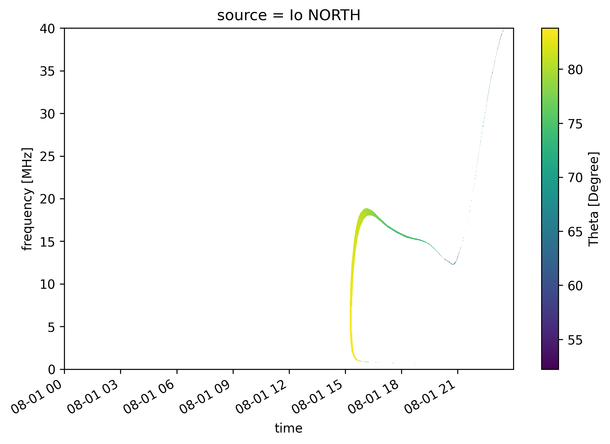
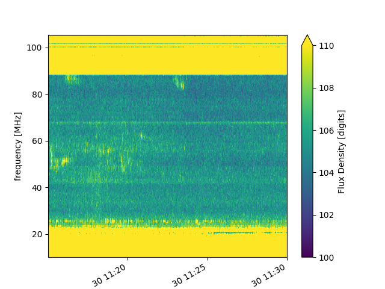
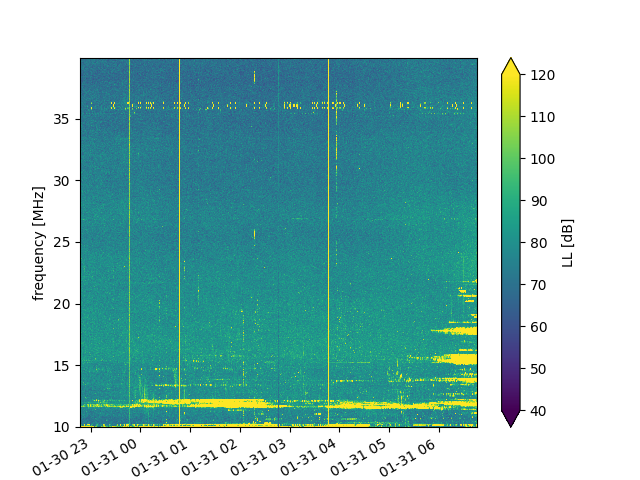
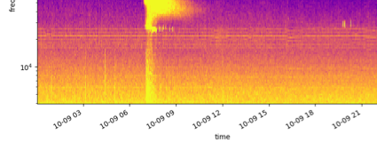

User guide
=============

Read radio data with maser-data
-------------------------------------

Quickstart
~~~~~~~~~~~

The `Data` class is a wrapper around several classes that allow you to read data supported by maser4py from various
formats, including CDF, FITS, and some custom binary formats. By default, the class will try to automatically detect
the format of the file and use the appropriate class to read the data.

.. code:: python

    from maser.data import Data

    filepath = "path/to/my/data/file.ext"
    data = Data(filepath=filepath)

Dataset Reference
~~~~~~~~~~~~~~~~~~

+-------------------+------------+------------------------------------------------------------------------------+--------+-------------+
| Facility          | Instrument | Dataset                                                                      | Format | Data Center |
+===================+============+==============================================================================+========+=============+
| Birr              | E-Callisto | :ref:`ecallisto <ecallisto>`                                                 | FITS   | E-Callisto  |
+-------------------+------------+------------------------------------------------------------------------------+--------+-------------+
| ExPRES            |            | expres_<observer>_<target>                                                   | CDF    | PADC        |
+-------------------+------------+------------------------------------------------------------------------------+--------+-------------+
| Interball-Auroral | POLRAD     | :ref:`cdpp_int_aur_polrad_rspn2 <cdpp_int_aur_polrad_rspn2>`                 | Binary | CDPP        |
+-------------------+------------+------------------------------------------------------------------------------+--------+-------------+
| Juno              | Waves      | :ref:`jno_wav_cdr_lesia <jno_wav_cdr_lesia>`                                 | CDF    | PADC        |
+-------------------+------------+------------------------------------------------------------------------------+--------+-------------+
| Mars-Express      | MARSIS     | :ref:`MEX-M-MARSIS-3-RDR-AIS-V1.0 <MEX-M-MARSIS-3-RDR-AIS-V1.0>`             | PDS3   | PSA         |
+-------------------+------------+------------------------------------------------------------------------------+--------+-------------+
| Mars-Express      | MARSIS     | :ref:`MEX-M-MARSIS-3-RDR-AIS-EXT1-V1.0 <MEX-M-MARSIS-3-RDR-AIS-V1.0>`        | PDS3   | PSA         |
+-------------------+------------+------------------------------------------------------------------------------+--------+-------------+
| Mars-Express      | MARSIS     | :ref:`MEX-M-MARSIS-3-RDR-AIS-EXT2-V1.0 <MEX-M-MARSIS-3-RDR-AIS-V1.0>`        | PDS3   | PSA         |
+-------------------+------------+------------------------------------------------------------------------------+--------+-------------+
| Mars-Express      | MARSIS     | :ref:`MEX-M-MARSIS-3-RDR-AIS-EXT3-V1.0 <MEX-M-MARSIS-3-RDR-AIS-V1.0>`        | PDS3   | PSA         |
+-------------------+------------+------------------------------------------------------------------------------+--------+-------------+
| Mars-Express      | MARSIS     | :ref:`MEX-M-MARSIS-3-RDR-AIS-EXT4-V1.0 <MEX-M-MARSIS-3-RDR-AIS-V1.0>`        | PDS3   | PSA         |
+-------------------+------------+------------------------------------------------------------------------------+--------+-------------+
| Mars-Express      | MARSIS     | :ref:`MEX-M-MARSIS-3-RDR-AIS-EXT5-V1.0 <MEX-M-MARSIS-3-RDR-AIS-V1.0>`        | PDS3   | PSA         |
+-------------------+------------+------------------------------------------------------------------------------+--------+-------------+
| Mars-Express      | MARSIS     | :ref:`MEX-M-MARSIS-3-RDR-AIS-EXT6-V1.0 <MEX-M-MARSIS-3-RDR-AIS-V1.0>`        | PDS3   | PSA         |
+-------------------+------------+------------------------------------------------------------------------------+--------+-------------+
| NDA               | Routine    | :ref:`srn_nda_routine_jup_edr <Msrn_nda_routine_jup_edr>`                    | CDF    | CDN         |
+-------------------+------------+------------------------------------------------------------------------------+--------+-------------+
| STEREO-A          | Waves      | :ref:`sta_l3_wav_lfr <sta_l3_wav_lfr>`                                       | CDF    | PADC        |
+-------------------+------------+------------------------------------------------------------------------------+--------+-------------+
| STEREO-A          | Waves      | :ref:`sta_l3_wav_hfr <sta_l3_wav_hfr>`                                       | CDF    | PADC        |
+-------------------+------------+------------------------------------------------------------------------------+--------+-------------+
| STEREO-B          | Waves      | :ref:`stb_l3_wav_lfr <stb_l3_wav_lfr>`                                       | CDF    | PADC        |
+-------------------+------------+------------------------------------------------------------------------------+--------+-------------+
| STEREO-B          | Waves      | :ref:`stb_l3_wav_hfr <stb_l3_wav_hfr>`                                       | CDF    | PADC        |
+-------------------+------------+------------------------------------------------------------------------------+--------+-------------+
| Voyager-1         | PRA        | :ref:`VG1-J-PRA-3-RDR-LOWBAND-6SEC-V1.0 <VG1-J-PRA-3-RDR-LOWBAND-6SEC-V1.0>` | PDS3   | PDS/PPI     |
+-------------------+------------+------------------------------------------------------------------------------+--------+-------------+
| Wind              | Waves      | :ref:`cdpp_wi_wa_rad1_l2_60s_v1 <cdpp_wi_wa_rad1_l2_60s_v1>`                 | Binary | CDPP        |
+-------------------+------------+------------------------------------------------------------------------------+--------+-------------+
| Wind              | Waves      | :ref:`cdpp_wi_wa_rad1_l2_60s_v2 <cdpp_wi_wa_rad1_l2_60s_v2>`                 | Binary | CDPP        |
+-------------------+------------+------------------------------------------------------------------------------+--------+-------------+
| Wind              | Waves      | :ref:`cdpp_wi_wa_rad2_l2_60s_v1 <cdpp_wi_wa_rad2_l2_60s_v1>`                 | Binary | CDPP        |
+-------------------+------------+------------------------------------------------------------------------------+--------+-------------+
| Wind              | Waves      | :ref:`cdpp_wi_wa_rad2_l2_60s_v2 <cdpp_wi_wa_rad2_l2_60s_v2>`                 | Binary | CDPP        |
+-------------------+------------+------------------------------------------------------------------------------+--------+-------------+
| Wind              | Waves      | :ref:`cdpp_wi_wa_tnr_l2_60s_v1 <cdpp_wi_wa_tnr_l2_60s_v1>`                   | Binary | CDPP        |
+-------------------+------------+------------------------------------------------------------------------------+--------+-------------+
| Wind              | Waves      | :ref:`cdpp_wi_wa_tnr_l2_60s_v2 <cdpp_wi_wa_tnr_l2_60s_v2>`                   | Binary | CDPP        |
+-------------------+------------+------------------------------------------------------------------------------+--------+-------------+

ExPRES
""""""""""""""""""""""""""""""

`ExPRES <https://maser.lesia.obspm.fr/task-2-modeling-tools/expres/?lang=en>`_ (Exoplanetary and Planetary Radio
Emission Simulator) simulations are stored in CDF files. They can be automatically read by `Data`.

A specificity for the ExPRES dataset classes is the additional attribute `source`, which is dataset-dependent.
It can either be specified as an argument (e.g., `Data('<expres_file.cdf>', source='Io NORTH')`) or as an attribute (see the following
example). If set to `None` (by default), the 'extra' dimension is kept.

.. code-block:: python

   from maser.data import Data
   from matplotlib import pyplot as plt
   expres_data = Data('tests/data/maser/expres/expres_earth_jupiter_io_jrm09_lossc-wid1deg_3kev_20220801_v01.cdf')
   expres_data.source = 'Io NORTH'
   data = expres_data.as_xarray()
   data['Theta'].plot()
   plt.show()

Interball-Auroral / POLRAD
""""""""""""""""""""""""""""""

All descriptions in this section are adapted from the `CDPP Data Archive portal <https://cdpp-archive.cnes.fr>`_.

The POLRAD instrument onboard the INTERBALL Auroral Probe is a radio-spectro-polarimeter aimed to
provide measurements of the auroral kilometric radiation (AKR) and plasma waves generated in the
Earth auroral regions from the orbit of the Interball Auroral Probe (Interball-2). Its scientific
objectives include studies of:

* AKR generation from sources associated with the field-aligned acceleration regions in the auroral
  magnetosphere,
* modes of AKR emission inferred from measurements of the Stokes parameters of the wave polarisation,
* direction finding and directivity of the AKR emission.

POLRAD is a step-frequency analyser (SFA) aimed at measuring intensity of the AKR and its polarization
parameters in the frequency range selected between 4 kHz and 2 MHz with a frequency resolution of
4.096 kHz. The detailed list of the instrumental characteristics are given in Table 1. Three orthogonal
antennae are used to detect wave electric fields: two 22 m long (tip-to-tip) dipoles perpendicular to
the spin axis of the spacecraft (Y and Z antennae) and one monopole 11 m long (center of the s/c to tip)
deployed along it in antisolar direction (X antenna).

.. _cdpp_int_aur_polrad_rspn2:

cdpp_int_aur_polrad_rspn2
.........................

* **Data Centre**: CNES/CDPP

The RSPN2 (*Radio Spectrograms Level 2*) dataset consist of receiver frequency sweeps, containing power
intensities of radio emission at consecutive frequency steps staring from the highest and ending on
the lowest (which is always 4 kHz), and information on the instrument status.

.. code-block:: python

   from maser.data import Data
   from matplotlib import pyplot as plt
   data = Data("tests/data/cdpp/interball/POLR_RSPN2_19990126")
   data.as_xarray()["EX"].plot(vmin=1e-20, vmax=1e-18)
   plt.show()

.. image:: figures/cdpp_int_aur_polrad_rspn2.png
   :width: 400
   :alt: cdpp_int_aur_polrad_rspn2 example plot

WIND/Waves
""""""""""""""""""""""""""""""

The WAVES experiment exploits instrumentation developed jointly by the Observatoire de Paris, the
University of Minnesota, and the Goddard Space Flight Center. The Radio and Plasma WAVES investigation
on the WIND spacecraft provides comprehensive coverage of radio and plasma wave phenomena in the frequency
range from a fraction of a Hertz up to about 14 MHz for the electric field and 3 kHz for the magnetic field.
This package permits several kinds of measurements all of which are essential to understanding the Earth's
environment - the Geospace - and its response to varying solar wind conditions. In situ measurements of
different modes of plasma waves give information on local processes and couplings in different regions and
boundaries of the Geospace leading to plasma instabilities: magneto-acoustic waves, ion cyclotron waves,
whistler waves, electron plasma oscillations, electron burst noise and other types of electrostatic or
electromagnetic waves.

The sensors are:

* three electric dipolar antenna systems supplied by Fairchild Space (two are coplanar, orthogonal wire
  dipole antennas in the spin-plane, the other a rigid spin-axis dipole);
* three magnetic search coils mounted orthogonally (designed and built by the University of Iowa).

.. _cdpp_wi_wa_rad1_l2_60s_v1:

cdpp_wi_wa_rad1_l2_60s_v1
.........................

* **Data Centre**: CNES/CDPP

.. code-block:: python

   from maser.data import Data
   data = Data("tests/data/cdpp/wind/wi_wa_rad1_l2_60s_19941114_v01.dat")

.. _cdpp_wi_wa_rad1_l2_60s_v2:

cdpp_wi_wa_rad1_l2_60s_v2
.........................

* **Data Centre**: CNES/CDPP

.. code-block:: python

   from maser.data import Data
   data = Data("tests/data/cdpp/wind/WIN_RAD1_60S_19941114.B3E")

.. _cdpp_wi_wa_rad2_l2_60s_v1:

cdpp_wi_wa_rad2_l2_60s_v1
.........................

* **Data Centre**: CNES/CDPP

.. code-block:: python

   from maser.data import Data
   data = Data("tests/data/cdpp/wind/wi_wa_rad2_l2_60s_19941114_v01.dat")

.. _cdpp_wi_wa_rad2_l2_60s_v2:

cdpp_wi_wa_rad2_l2_60s_v2
.........................

* **Data Centre**: CNES/CDPP

.. code-block:: python

   from maser.data import Data
   data = Data("tests/data/cdpp/wind/WIN_RAD2_60S_19941114.B3E")

.. _cdpp_wi_wa_tnr_l2_60s_v1:

cdpp_wi_wa_tnr_l2_60s_v1
.........................

* **Data Centre**: CNES/CDPP

.. code-block:: python

   from maser.data import Data
   data = Data("tests/data/cdpp/wind/wi_wa_tnr_l2_60s_19941114_v01.dat")

.. _cdpp_wi_wa_tnr_l2_60s_v2:

cdpp_wi_wa_tnr_l2_60s_v2
.........................

* **Data Centre**: CNES/CDPP

.. code-block:: python

   from maser.data import Data
   data = Data("tests/data/cdpp/wind/WIN_TNR_60S_19941114.B3E")

.. _cdpp_wi_wa_rad1_l2:

cdpp_wi_wa_rad1_l2
..................

* **Data Centre**: CNES/CDPP

.. code-block:: python

   from maser.data import Data
   data = Data("tests/data/cdpp/wind/wi_wa_rad1_l2_19941110_v01.dat")

Mars-Express / MARSIS
""""""""""""""""""""""""""""""

.. _MEX-M-MARSIS-3-RDR-AIS-V1.0:

MEX-M-MARSIS-3-RDR-AIS-V1.0
...........................

* **Data Centre**: ESA/PSA

Sub-collections from ESA/PSA archive: ``MEX-M-MARSIS-3-RDR-AIS-V1.0``, ``MEX-M-MARSIS-3-RDR-AIS-EXT1-V1.0``,
``MEX-M-MARSIS-3-RDR-AIS-EXT2-V1.0``, ``MEX-M-MARSIS-3-RDR-AIS-EXT3-V1.0``, ``MEX-M-MARSIS-3-RDR-AIS-EXT4-V1.0``,
``MEX-M-MARSIS-3-RDR-AIS-EXT5-V1.0`` and ``MEX-M-MARSIS-3-RDR-AIS-EXT6-V1.0``.

Juno / Waves
""""""""""""""""""""""""""""""

.. _jno_wav_cdr_lesia:

jno_wav_cdr_lesia
.................

* **Data Centre**: ObsParis/PADC

.. code-block:: python

   from maser.data import Data
   import numpy as np
   from matplotlib import pyplot as plt
   data = Data("tests/data/maser/juno/jno_wav_cdr_lesia_20170329_v02.cdf")
   xd = data.as_xarray()
   xd.values = 10 * np.log(xd.values)
   xd.attrs["units"] = f"dB ({xd.attrs['units']})"
   xd.plot(yscale="log")
   plt.show()

.. image:: figures/jno_wav_cdr_lesia.png
   :width: 400
   :alt: jno_wav_cdr_lesia example plot

Voyager / PRA
""""""""""""""""""""""""""""""

.. _VG1-J-PRA-3-RDR-LOWBAND-6SEC-V1.0:

VG1-J-PRA-3-RDR-LOWBAND-6SEC-V1.0
.................................

* **Data Centre**: NASA/PDS/PPI

.. code-block:: python

   from maser.data import Data
   from matplotlib import pyplot as plt
   data = Data("tests/data/pds/VG1-J-PRA-4-SUMM-BROWSE-48SEC-V1/T790306.LBL")
   xd = data.as_xarray()
   xd['L'].plot(vmin=40, vmax=70)
   plt.title(f"{v.dataset}:{v.filepath.stem}")
   plt.show()

.. image:: figures/_vg1_j_pra_3_rdr_lowband_6sec_v1.png
   :width: 400
   :alt: _vg1_j_pra_3_rdr_lowband_6sec_v1 example plot

E-Callisto
""""""""""""""""""""""""""""""

.. _ecallisto:

ecallisto
.........

* **Data Centre**: E-Callisto

.. code-block:: python

   from maser.data import Data
   from matplotlib import pyplot as plt
   data = Data("tests/data/e-callisto/BIR/BIR_20220130_111500_01.fit")
   xd = data.as_xarray()
   xd.plot(vmin=100, vmax=110)
   plt.title(xd.attrs['title'])
   plt.show()

Nançay Decameter Array (NDA)
""""""""""""""""""""""""""""""

.. _srn_nda_routine_jup_edr:

srn_nda_routine_jup_edr
.......................

* **Data Centre**: Centre de Données de Nançay (CDN)

.. code-block:: python

   from maser.data import Data
   from matplotlib import pyplot as plt
   data = Data("tests/data/nda/routine/srn_nda_routine_jup_edr_201601302247_201601310645_V12.cdf")
   xd = data.as_xarray()
   xd.plot(vmin=40, vmax=120)
   plt.title(xd.attrs['title'])
   plt.show()

STEREO-A and STEREO-B / Waves / LFR and HFR
"""""""""""""""""""""""""""""""""""""""""""

.. _sta_l3_wav_lfr:

sta_l3_wav_lfr
...............

* **Data Centre**: Paris Astronomical Data Centre (PADC)

.. code-block:: python

   from maser.data import Data
   from matplotlib import pyplot as plt
   data = Data("tests/data/swaves/l3_cdf/sta_l3_wav_lfr_20200711_v01.cdf")
   xd = data.as_xarray()
   xd.plot(vmin=40, vmax=120)
   plt.title(xd.attrs['title'])
   plt.show()

Plot radio data with maser-plot
-------------------------------------

Quickstart
~~~~~~~~~~~

maser-plot offers "read-to-use" data plotting capabilities in complement to maser-data.

For the moment it only works with data from Solar Orbiter/RPW, but additional data should be added later.

Here is a example to read and plot Solar Orbiter/RPW TNR receiver dynamical spectrum using maser-data, maser-plot and matplotlib:

.. code:: python

    from maser.data import Data
    from maser.plot.rpw.tnr import plot_auto

    # Parse TNR CDF file with maser.data.Data class
    tnr_filepath = "solo_L2_rpw-tnr-surv_20211009_V02.cdf"
    tnr_data = Data(filepath=tnr_filepath)

     # Plot data "as is" (i.e., without any post-processing or filters)
    import matplotlib.pyplot as plt
    import matplotlib.colorbar as cbar

    fig, ax = plt.subplots(figsize=(10, 5))
    # Define plot main title
    #fig.suptitle("RPW Tuto")
    fig.tight_layout()
    cbar_ax, kw = cbar.make_axes(ax, shrink=1.4)
    # plot AUTO
    plot_auto(tnr_data, ax=ax, figure=fig, cbar_ax=cbar_ax)
    # Define plot subtitle
    ax.set_title('RPW TNR spectral power density from ' + filepath.name)
    plt.show()

Which should give:

.. note:: using matplotlib is not mandatory here, but permits to refine plotting options.

Extra tools from maser-tools
-----------------------------

Quickstart
~~~~~~~~~~~

maser-tools offers methods to handle radio data file format and time.

It currently contains programs to :
    - handle `CDF file format <https://cdf.gsfc.nasa.gov/>`_
    - Ensure conversions between time bases (i.e. TT2000<->UTC)

Examples
"""""""""""""""

Compare two CDF files content with ``cdf_compare``
.....................................................

.. code:: python

    from maser.tools.cdf.cdf_compare import cdf_compare

    # Define paths of the two CDF files to compare
    cdf_file1 = 'cdf_file1_path'
    cdf_file2 = 'cdf_file2_path'

    # Run cdf_compare
    results = cdf_compare(cdf_file1, cdf_file2)

    if results:
        # If differences are found, print them
        print(results)
    else:
        print('No difference found between {0} and {1}'.format(cdf_file1, cdf_file2))

If no discrepancy is found between the two input CDF files, the dictionary `results` should be empty. Otherwise, it should contain differences found between both CDF files.

.. note::

    - By default ``cdf_compare`` also checks the CDF attributes.
    - ``cdf_compare`` can also be run as a command line tool. Run `maser cdf_compare --help` from a terminal for more information.

Convert master binary CDF into MS Excel sheet file
.....................................................

Here is an example to export a master CDF binary file into
a MS Excel sheet file using maser-tool:

.. code:: bash

    cdf_file=master_binary.cdf
    build_dir=./build
    maser skeletontable --to-xlsx -o $build_dir $cdf_file

Running the command below should create a new file `master_binary.xlsx` in the `build` folder.

.. note::

    - It is also possible to provide a Skeleton table file as an input (instead of master CDF binary file)
    - Use `maser skeletoncdf` command to generate skeleton table and master CDF files from an MS Excel file.
    - Example of export Excel file can be found in `support/cdf/convert_example.xlsx`

Download and show the leap seconds table (`CDFLeapSeconds.txt`)
.................................................................

maser-tools allows users to retrive and show the content of the `CDFLeapSeconds.txt` file, as provided by the NASA CDF Team (i.e., https://cdf.gsfc.nasa.gov/html/CDFLeapSeconds.txt).

To download the `CDFLeapSeconds.txt` file:

.. code:: bash

    maser leapsec -D

To print leap seconds table:

.. code:: bash

    maser leapsec -S

Run ``maser leapsec --help`` to see the command help.

.. note::

    By default, the `CDFLeapSeconds.txt` file is downloaded in the `support/data` sub-folder of the `maser-tools` directory.
