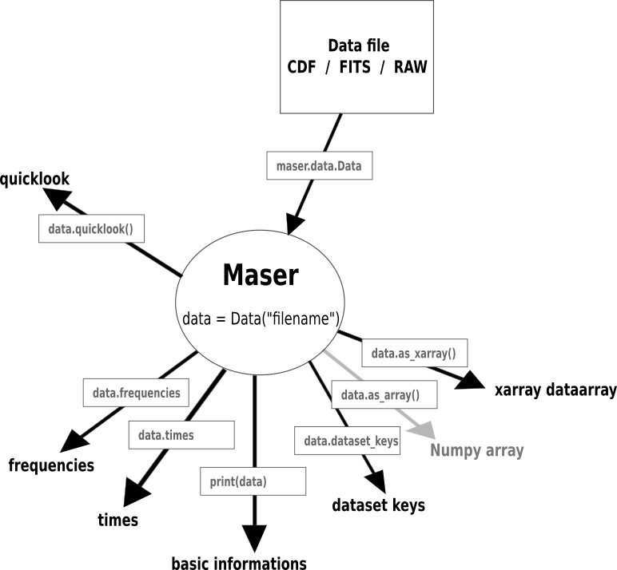

User guide
=============

.. _sec_user_guide:

The following 3 sections will quickly introduce the three submodules :ref:`maser-data<maser_data>`, :ref:`maser-plot<maser_plot>` and :ref:`maser-tools<maser_tools>`,
their usages and short examples.

.. _maser_data:

Read radio data with maser-data
-------------------------------------

Quickstart
~~~~~~~~~~~

The `Data` class is a wrapper around several classes that allow you to read data supported by maser4py from various
formats, including CDF, FITS, and some custom binary formats. By default, the class will try to automatically detect
the format of the file and use the appropriate class to read the data.

.. code:: python

    from maser.data import Data

    filepath = "path/to/my/data/file.ext"
    data = Data(filepath=filepath)

Methods and properties can then be called from this main `Data` class. For example, it is possible to retrieve the data under a `Dataset` format
(a slightly upgraded `dict` of `DataArray`, see xarray documentation: <https://pypi.org/project/xarray/>) with:

.. code:: python

    data_xarr = data.as_xarray()

.. note::

    ExPRES dataset is a special case where one extra argument `source` is required. See :ref:`ExPRES<EXPRES_dataset>` for more detail.

A list of main properties and methods is shown on the diagram and table below:

+-------------------+----------+---------------------+------------------------+---------------------------------------------------------+
| Method / Property | Type     |  Call               | Output format          | Description                                             |
+===================+==========+=====================+========================+=========================================================+
| times             | property | `data.times`        | astropy.time.Time      | retrieve the time coordinate                            |
+-------------------+----------+---------------------+------------------------+---------------------------------------------------------+
| delta_times       | property | `data.delta_times`  | astropy.time.TimeDelta | retrieve the table of difference to the time coordinate |
+-------------------+----------+---------------------+------------------------+---------------------------------------------------------+
| frequencies       | property | `data.frequencies`  | astropy.units.Quantity | retrieve the frequency coordinate                       |
+-------------------+----------+---------------------+------------------------+---------------------------------------------------------+
| dataset_keys      | property | `data.dataset_keys` | list                   | retrieve the list of keys of the dataset                |
+-------------------+----------+---------------------+------------------------+---------------------------------------------------------+
+-------------------+----------+---------------------+------------------------+---------------------------------------------------------+
| as_array          | method   | `data.as_array()`   | numpy.ndarray          | retrieve data under array format                        |
+-------------------+----------+---------------------+------------------------+---------------------------------------------------------+
| as_xarray         | method   | `data.as_xarray()`  | xarray.Dataset         | retrieve data under xarray format                       |
+-------------------+----------+---------------------+------------------------+---------------------------------------------------------+
| quicklook         | method   | `data.quicklook()`  | None                   | produce a quicklook of the data                         |
+-------------------+----------+---------------------+------------------------+---------------------------------------------------------+
| epncore           | method   | `data.epncore()`    | dict                   | retrieve metadata of the dataset                        |
+-------------------+----------+---------------------+------------------------+---------------------------------------------------------+

.. note::

    Amongst methods, only the `quicklook` method accepts additionnal optional arguments.
    `quicklook` accepts its own arguments on top of most `matplotlib.pyplot` typical arguments,
    `quicklook` wrapping `pyplot.pcolormesh` through `xarray`. For a list of arguments, please use `help(Data.quicklook)` for own arguments and
    refer to: <https://docs.xarray.dev/en/stable/user-guide/plotting.html> and <https://matplotlib.org/stable/api/_as_gen/matplotlib.pyplot.pcolormesh.html>
    for extra arguments.

.. note::
    The `as_array()` method is not implemented yet, as `xarrays` can be converted to `numpy ndarrays`, while being more flexible, lighter and more powerful.
    If you specifically need `numpy ndarray`, please have a look at <https://docs.xarray.dev/en/stable/generated/xarray.DataArray.to_numpy.html> .

Dataset Reference
~~~~~~~~~~~~~~~~~~

You will find in this section, first a table of all available datasets, and then the details for each dataset. Each dataset subsection contain a short description and
the list of the dataset keys, the only required information to manage each dataset.

.. note::

   Dataset keys can be obtained directly in your terminal for each dataset by using:

   .. code:: python

       from maser.data import Data

       filepath = "path/to/my/data/file.ext"
       data = Data(filepath=filepath)
       print(data.dataset_keys)

If you are looking for a specific dataset, the easiest it to use the link in the table below. If you want examples,
the :ref:`Examples and notebooks<sec_examples_and_notebooks>` section of the documentation contain examples for each dataset.

+-------------------+------------+------------------------------------------------------------------------------+--------+-------------+
| Facility          | Instrument | Dataset                                                                      | Format | Data Center |
+===================+============+==============================================================================+========+=============+
| BepiColombo / MMO | PWI/SORBET | :ref:`mmo_pwi_sorbet_l1_ex_specdB-tnr-qtn_ <sorbet_l1_ex-tnr-qtn_>`          | CDF    | PADC        |
+-------------------+------------+------------------------------------------------------------------------------+--------+-------------+
| BepiColombo / MMO | PWI/SORBET | :ref:`mmo_pwi_sorbet_l1_bz-ex_complex-specdB-tnr <sorbet_l1_bz-ex-tnr>`      | CDF    | PADC        |
+-------------------+------------+------------------------------------------------------------------------------+--------+-------------+
| Birr              | E-Callisto | :ref:`ecallisto <ecallisto>`                                                 | FITS   | E-Callisto  |
+-------------------+------------+------------------------------------------------------------------------------+--------+-------------+
| Cassini           | RPWS       | :ref:`co_rpws_hfr_kronos_n1 <co_rpws_hfr_kronos_n1>`                         | Binary | PADC        |
+-------------------+------------+------------------------------------------------------------------------------+--------+-------------+
| Cassini           | RPWS       | :ref:`co_rpws_hfr_kronos_n2 <co_rpws_hfr_kronos_n2>`                         | Binary | PADC        |
+-------------------+------------+------------------------------------------------------------------------------+--------+-------------+
| Cassini           | RPWS       | :ref:`co_rpws_hfr_kronos_n3d <co_rpws_hfr_kronos_n3d>`                       | Binary | PADC        |
+-------------------+------------+------------------------------------------------------------------------------+--------+-------------+
| Cassini           | RPWS       | :ref:`co_rpws_hfr_kronos_n3e <co_rpws_hfr_kronos_n3e>`                       | Binary | PADC        |
+-------------------+------------+------------------------------------------------------------------------------+--------+-------------+
| ExPRES            |            | expres_<observer>_<target>                                                   | CDF    | PADC        |
+-------------------+------------+------------------------------------------------------------------------------+--------+-------------+
| Interball-Auroral | POLRAD     | :ref:`cdpp_int_aur_polrad_rspn2 <cdpp_int_aur_polrad_rspn2>`                 | Binary | CDPP        |
+-------------------+------------+------------------------------------------------------------------------------+--------+-------------+
| Juno              | Waves      | :ref:`jno_wav_cdr_lesia <jno_wav_cdr_lesia>`                                 | CDF    | PADC        |
+-------------------+------------+------------------------------------------------------------------------------+--------+-------------+
| Mars-Express      | MARSIS     | :ref:`MEX-M-MARSIS-3-RDR-AIS-V1.0 <MEX-M-MARSIS-3-RDR-AIS-V1.0>`             | PDS3   | PSA         |
+-------------------+------------+------------------------------------------------------------------------------+--------+-------------+
| Mars-Express      | MARSIS     | :ref:`MEX-M-MARSIS-3-RDR-AIS-EXT1-V1.0 <MEX-M-MARSIS-3-RDR-AIS-V1.0>`        | PDS3   | PSA         |
+-------------------+------------+------------------------------------------------------------------------------+--------+-------------+
| Mars-Express      | MARSIS     | :ref:`MEX-M-MARSIS-3-RDR-AIS-EXT2-V1.0 <MEX-M-MARSIS-3-RDR-AIS-V1.0>`        | PDS3   | PSA         |
+-------------------+------------+------------------------------------------------------------------------------+--------+-------------+
| Mars-Express      | MARSIS     | :ref:`MEX-M-MARSIS-3-RDR-AIS-EXT3-V1.0 <MEX-M-MARSIS-3-RDR-AIS-V1.0>`        | PDS3   | PSA         |
+-------------------+------------+------------------------------------------------------------------------------+--------+-------------+
| Mars-Express      | MARSIS     | :ref:`MEX-M-MARSIS-3-RDR-AIS-EXT4-V1.0 <MEX-M-MARSIS-3-RDR-AIS-V1.0>`        | PDS3   | PSA         |
+-------------------+------------+------------------------------------------------------------------------------+--------+-------------+
| Mars-Express      | MARSIS     | :ref:`MEX-M-MARSIS-3-RDR-AIS-EXT5-V1.0 <MEX-M-MARSIS-3-RDR-AIS-V1.0>`        | PDS3   | PSA         |
+-------------------+------------+------------------------------------------------------------------------------+--------+-------------+
| Mars-Express      | MARSIS     | :ref:`MEX-M-MARSIS-3-RDR-AIS-EXT6-V1.0 <MEX-M-MARSIS-3-RDR-AIS-V1.0>`        | PDS3   | PSA         |
+-------------------+------------+------------------------------------------------------------------------------+--------+-------------+
| NDA               | Routine    | :ref:`srn_nda_routine_jup_edr <srn_nda_routine_jup_edr>`                     | CDF    | CDN         |
+-------------------+------------+------------------------------------------------------------------------------+--------+-------------+
| NDA               | Routine    | :ref:`srn_nda_routine_sun_edr <srn_nda_routine_sun_edr>`                     | CDF    | CDN         |
+-------------------+------------+------------------------------------------------------------------------------+--------+-------------+
| NDA               | NewRoutine | :ref:`orn_nda_newroutine_jup_edr <orn_nda_newroutine_jup_edr>`               | FITS   | CDN         |
+-------------------+------------+------------------------------------------------------------------------------+--------+-------------+
| NDA               | NewRoutine | :ref:`orn_nda_newroutine_sun_edr <orn_nda_newroutine_sun_edr>`               | FITS   | CDN         |
+-------------------+------------+------------------------------------------------------------------------------+--------+-------------+
| NDA               | NewRoutine | :ref:`orn_nda_newroutine_transit_edr <orn_nda_newroutine_transit_edr>`       | FITS   | CDN         |
+-------------------+------------+------------------------------------------------------------------------------+--------+-------------+
| NDA               | Mefisto    | :ref:`orn_nda_mefisto_sun_edr <orn_nda_mefisto_sun_edr>`                     | FITS   | CDN         |
+-------------------+------------+------------------------------------------------------------------------------+--------+-------------+
| NenuFAR           | NenuFAR/BST| :ref:`orn_nenufar_bst <orn_nenufar_bst>`                                     | FITS   | CDN         |
+-------------------+------------+------------------------------------------------------------------------------+--------+-------------+
| SolarOrbiter      | RPW        | :ref:`solo_L2_rpw-hfr-surv <solo_L2_rpw-hfr-surv>`                           | CDF    | PADC        |
+-------------------+------------+------------------------------------------------------------------------------+--------+-------------+
| SolarOrbiter      | RPW        | :ref:`solo_L2_rpw-tnr-surv <solo_L2_rpw-tnr-surv>`                           | CDF    | PADC        |
+-------------------+------------+------------------------------------------------------------------------------+--------+-------------+
| SolarOrbiter      | RPW        | :ref:`solo_L2_rpw-lfr-surv-bp1 <solo_L2_rpw-lfr-surv-bp1>`                   | CDF    | PADC        |
+-------------------+------------+------------------------------------------------------------------------------+--------+-------------+
| SolarOrbiter      | RPW        | :ref:`solo_L3_rpw-hfr-flux_ <solo_L3_rpw-hfr-flux_>`                         | CDF    | PADC        |
+-------------------+------------+------------------------------------------------------------------------------+--------+-------------+
| SolarOrbiter      | RPW        | :ref:`solo_L3_rpw-tnr-flux_ <solo_L3_rpw-tnr-flux_>`                         | CDF    | PADC        |
+-------------------+------------+------------------------------------------------------------------------------+--------+-------------+
| STEREO-A          | Waves      | :ref:`sta_l3_wav_lfr <sta_l3_wav_lfr>`                                       | CDF    | PADC        |
+-------------------+------------+------------------------------------------------------------------------------+--------+-------------+
| STEREO-A          | Waves      | :ref:`sta_l3_wav_hfr <sta_l3_wav_hfr>`                                       | CDF    | PADC        |
+-------------------+------------+------------------------------------------------------------------------------+--------+-------------+
| STEREO-B          | Waves      | :ref:`stb_l3_wav_lfr <stb_l3_wav_lfr>`                                       | CDF    | PADC        |
+-------------------+------------+------------------------------------------------------------------------------+--------+-------------+
| STEREO-B          | Waves      | :ref:`stb_l3_wav_hfr <stb_l3_wav_hfr>`                                       | CDF    | PADC        |
+-------------------+------------+------------------------------------------------------------------------------+--------+-------------+
| STEREO-A          | Waves      | :ref:`cdpp_sta_l2_wav_h_res_lfr <sta_l2_wav_lfr>`                            | Binary | CDPP        |
+-------------------+------------+------------------------------------------------------------------------------+--------+-------------+
| STEREO-A          | Waves      | :ref:`cdpp_sta_l2_wav_h_res_hfr <sta_l2_wav_hfr>`                            | Binary | CDPP        |
+-------------------+------------+------------------------------------------------------------------------------+--------+-------------+
| STEREO-B          | Waves      | :ref:`cdpp_stb_l2_wav_h_res_lfr <stb_l2_wav_lfr>`                            | Binary | CDPP        |
+-------------------+------------+------------------------------------------------------------------------------+--------+-------------+
| STEREO-B          | Waves      | :ref:`cdpp_stb_l2_wav_h_res_hfr <stb_l2_wav_hfr>`                            | Binary | CDPP        |
+-------------------+------------+------------------------------------------------------------------------------+--------+-------------+
| Viking            |            | :ref:`cdpp_viking_v4n_e5 <cdpp_viking_v4n_e5>`                               | Binary | CDPP        |
+-------------------+------------+------------------------------------------------------------------------------+--------+-------------+
| Voyager-1         | PRA        | :ref:`VG1-J-PRA-3-RDR-LOWBAND-6SEC-V1.0 <VG1-J-PRA-3-RDR-LOWBAND-6SEC-V1.0>` | PDS3   | PDS/PPI     |
+-------------------+------------+------------------------------------------------------------------------------+--------+-------------+
| Wind              | Waves      | :ref:`cdpp_wi_wa_rad1_l2_60s_v1 <cdpp_wi_wa_rad1_l2_60s_v1>`                 | Binary | CDPP        |
+-------------------+------------+------------------------------------------------------------------------------+--------+-------------+
| Wind              | Waves      | :ref:`cdpp_wi_wa_rad1_l2_60s_v2 <cdpp_wi_wa_rad1_l2_60s_v2>`                 | Binary | CDPP        |
+-------------------+------------+------------------------------------------------------------------------------+--------+-------------+
| Wind              | Waves      | :ref:`cdpp_wi_wa_rad2_l2_60s_v1 <cdpp_wi_wa_rad2_l2_60s_v1>`                 | Binary | CDPP        |
+-------------------+------------+------------------------------------------------------------------------------+--------+-------------+
| Wind              | Waves      | :ref:`cdpp_wi_wa_rad2_l2_60s_v2 <cdpp_wi_wa_rad2_l2_60s_v2>`                 | Binary | CDPP        |
+-------------------+------------+------------------------------------------------------------------------------+--------+-------------+
| Wind              | Waves      | :ref:`cdpp_wi_wa_tnr_l2_60s_v1 <cdpp_wi_wa_tnr_l2_60s_v1>`                   | Binary | CDPP        |
+-------------------+------------+------------------------------------------------------------------------------+--------+-------------+
| Wind              | Waves      | :ref:`cdpp_wi_wa_tnr_l2_60s_v2 <cdpp_wi_wa_tnr_l2_60s_v2>`                   | Binary | CDPP        |
+-------------------+------------+------------------------------------------------------------------------------+--------+-------------+
| Wind              | Waves      | :ref:`wi_wa_rad1_l3-akr <wi_wa_rad1_l3-akr>`                                 | CDF    | PADC        |
+-------------------+------------+------------------------------------------------------------------------------+--------+-------------+
| Wind              | Waves      | :ref:`wi_wav_rad1_l3_df_v02 <wi_wav_rad1_l3_df_v02>`                         | CDF    | PADC        |
+-------------------+------------+------------------------------------------------------------------------------+--------+-------------+

.. _EXPRES_dataset:

ExPRES
""""""""""""""""""""""""""""""

`ExPRES <https://maser.lesia.obspm.fr/task-2-modeling-tools/expres/?lang=en>`_ (Exoplanetary and Planetary Radio
Emission Simulator) simulations are stored in CDF files. They can be automatically read by `Data`.

A specificity for the ExPRES dataset classes is the additional attribute `source`, which is dataset-dependent.
It can either be specified as an argument (e.g., `Data('<expres_file.cdf>', source='Io NORTH')`) or as an attribute (see the following
example). If set to `None` (by default), the 'extra' dimension is kept.

.. code-block:: python

   from maser.data import Data
   from matplotlib import pyplot as plt
   expres_data = Data('tests/data/maser/expres/expres_earth_jupiter_io_jrm09_lossc-wid1deg_3kev_20220801_v01.cdf')
   expres_data.source = 'Io NORTH'
   data = expres_data.as_xarray()
   data['Theta'].plot()
   plt.show()

.. image:: figures/expres_example.png
   :width: 500
   :alt: expres example plot

.. code-block:: python

   keys = [
      "FC",
      "FP",
      "Polarization",
      "Theta",
      "CML",
      "ObsDistance",
      "ObsLatitude",
      "SrcFreqMax",
      "SrcFreqMaxCMI",
      "SrcLongitude",
   ]

Interball-Auroral / POLRAD
""""""""""""""""""""""""""""""

All descriptions in this section are adapted from the `CDPP Data Archive portal <https://cdpp-archive.cnes.fr>`_.

The POLRAD instrument onboard the INTERBALL Auroral Probe is a radio-spectro-polarimeter aimed to
provide measurements of the auroral kilometric radiation (AKR) and plasma waves generated in the
Earth auroral regions from the orbit of the Interball Auroral Probe (Interball-2). Its scientific
objectives include studies of:

* AKR generation from sources associated with the field-aligned acceleration regions in the auroral
  magnetosphere,
* modes of AKR emission inferred from measurements of the Stokes parameters of the wave polarisation,
* direction finding and directivity of the AKR emission.

POLRAD is a step-frequency analyser (SFA) aimed at measuring intensity of the AKR and its polarization
parameters in the frequency range selected between 4 kHz and 2 MHz with a frequency resolution of
4.096 kHz. The detailed list of the instrumental characteristics are given in Table 1. Three orthogonal
antennae are used to detect wave electric fields: two 22 m long (tip-to-tip) dipoles perpendicular to
the spin axis of the spacecraft (Y and Z antennae) and one monopole 11 m long (center of the s/c to tip)
deployed along it in antisolar direction (X antenna).

.. _cdpp_int_aur_polrad_rspn2:

cdpp_int_aur_polrad_rspn2
.........................

* **Data Centre**: CNES/CDPP

The RSPN2 (*Radio Spectrograms Level 2*) dataset consist of receiver frequency sweeps, containing power
intensities of radio emission at consecutive frequency steps staring from the highest and ending on
the lowest (which is always 4 kHz), and information on the instrument status.

.. code-block:: python

   keys = ["EX", "EY", "EZ"]

WIND/Waves
""""""""""""""""""""""""""""""

The WAVES experiment exploits instrumentation developed jointly by the Observatoire de Paris, the
University of Minnesota, and the Goddard Space Flight Center. The Radio and Plasma WAVES investigation
on the WIND spacecraft provides comprehensive coverage of radio and plasma wave phenomena in the frequency
range from a fraction of a Hertz up to about 14 MHz for the electric field and 3 kHz for the magnetic field.
This package allows several kinds of measurements all of which are essential to understanding the Earth's
environment - the Geospace - and its response to varying solar wind conditions. In situ measurements of
different modes of plasma waves give information on local processes and couplings in different regions and
boundaries of the Geospace leading to plasma instabilities: magneto-acoustic waves, ion cyclotron waves,
whistler waves, electron plasma oscillations, electron burst noise and other types of electrostatic or
electromagnetic waves.

The sensors are:

* three electric dipolar antenna systems supplied by Fairchild Space (two are coplanar, orthogonal wire
  dipole antennas in the spin-plane, the other a rigid spin-axis dipole);
* three magnetic search coils mounted orthogonally (designed and built by the University of Iowa).

.. _cdpp_wi_wa_rad1_l2_60s_v1:

cdpp_wi_wa_rad1_l2_60s_v1
.........................

* **Data Centre**: CNES/CDPP

.. code-block:: python

   "Work in progress"

.. _cdpp_wi_wa_rad1_l2_60s_v2:

cdpp_wi_wa_rad1_l2_60s_v2
.........................

* **Data Centre**: CNES/CDPP

.. code-block:: python

   "Work in progress"

.. _cdpp_wi_wa_rad2_l2_60s_v1:

cdpp_wi_wa_rad2_l2_60s_v1
.........................

* **Data Centre**: CNES/CDPP

.. code-block:: python

   "Work in progress"

.. _cdpp_wi_wa_rad2_l2_60s_v2:

cdpp_wi_wa_rad2_l2_60s_v2
.........................

* **Data Centre**: CNES/CDPP

.. code-block:: python

   "Work in progress"

.. _cdpp_wi_wa_tnr_l2_60s_v1:

cdpp_wi_wa_tnr_l2_60s_v1
.........................

* **Data Centre**: CNES/CDPP

.. code-block:: python

   "Work in progress"

.. _cdpp_wi_wa_tnr_l2_60s_v2:

cdpp_wi_wa_tnr_l2_60s_v2
.........................

* **Data Centre**: CNES/CDPP

.. code-block:: python

   "Work in progress"

.. _cdpp_wi_wa_rad1_l2:

cdpp_wi_wa_rad1_l2
..................

* **Data Centre**: CNES/CDPP

.. code-block:: python

   keys = ["VS", "VSP", "VZ", "TS", "TSP", "TZ", "MODE"]

.. _wi_wa_rad1_l3-akr:

wi_wa_rad1_l3-akr
.................

* **Data Centre**: ObsParis/PADC

.. code-block:: python

   keys = [
        "FLUX_DENSITY",
        "SNR",
    ]

.. _wi_wav_rad1_l3_df_v02:

wi_wav_rad1_l3_df_v02
......................

* **Data Centre**: ObsParis/PADC

.. code-block:: python

   keys = [
        "STOKES_I",
        "SWEEP",
        "WAVE_AZIMUTH_SRF",
        "WAVE_COLATITUDE_SRF",
        "SOURCE_SIZE",
        "QUALITY_FLAG",
        "MODULATION_RATE",
    ]

Mars-Express / MARSIS
""""""""""""""""""""""""""""""

.. _MEX-M-MARSIS-3-RDR-AIS-V1.0:

MEX-M-MARSIS-3-RDR-AIS-V1.0
...........................

* **Data Centre**: ESA/PSA

Sub-collections from ESA/PSA archive: ``MEX-M-MARSIS-3-RDR-AIS-V1.0``, ``MEX-M-MARSIS-3-RDR-AIS-EXT1-V1.0``,
``MEX-M-MARSIS-3-RDR-AIS-EXT2-V1.0``, ``MEX-M-MARSIS-3-RDR-AIS-EXT3-V1.0``, ``MEX-M-MARSIS-3-RDR-AIS-EXT4-V1.0``,
``MEX-M-MARSIS-3-RDR-AIS-EXT5-V1.0`` and ``MEX-M-MARSIS-3-RDR-AIS-EXT6-V1.0``.

.. code-block:: python

   keys = [
        "SPECTRAL_DENSITY",
        "SPECTRAL_DENSITY_AVG",
        "SPECTRAL_DENSITY_MED",
        "SPECTRAL_DENSITY_MAX",
        "SPECTRAL_DENSITY_MIN",
    ]

Juno / Waves
""""""""""""""""""""""""""""""

.. _jno_wav_cdr_lesia:

jno_wav_cdr_lesia
.................

* **Data Centre**: ObsParis/PADC

.. code-block:: python

   keys = [
      "INTENSITY",
      "BACKGROUND",
      "INTENSITY_BG_COR",
   ]

Voyager / PRA
""""""""""""""""""""""""""""""

.. _VG1-J-PRA-3-RDR-LOWBAND-6SEC-V1.0:

.. warning::
    Time for Voyager are known for not being recorded in a not monotonic way. Be careful with these data.

VG1-J-PRA-3-RDR-LOWBAND-6SEC-V1.0
.................................

* **Data Centre**: NASA/PDS/PPI

.. code-block:: python

   keys = ["L", "R"]

Viking
""""""

.. _cdpp_viking_v4n_e5:

cdpp_viking_v4n_e5
..................

* **Data Centre**: NASA/PDS/PPI

.. code-block:: python

   "Work in progress"

E-Callisto
""""""""""""""""""""""""""""""

.. _ecallisto:

ecallisto
.........

* **Data Centre**: E-Callisto

.. code-block:: python

   keys = ["Flux Density"]

Nançay Decameter Array (NDA)
""""""""""""""""""""""""""""""

.. _srn_nda_routine_jup_edr:

srn_nda_routine_jup_edr
.......................

* **Data Centre**: Centre de Données de Nançay (CDN)

.. code-block:: python

   keys = ["LL", "RR"]

.. _srn_nda_routine_sun_edr:

srn_nda_routine_sun_edr
.......................

* **Data Centre**: Centre de Données de Nançay (CDN)

.. code-block:: python

   keys = ["LL", "RR"]

.. _orn_nda_newroutine_jup_edr:

orn_nda_newroutine_jup_edr
...........................

* **Data Centre**: Centre de Données de Nançay (CDN)

.. code-block:: python

   keys = ["LL", "RR", "TBD", "TBD"]

.. _orn_nda_newroutine_sun_edr:

orn_nda_newroutine_sun_edr
...........................

* **Data Centre**: Centre de Données de Nançay (CDN)

.. code-block:: python

   keys = ["LL", "RR"]

.. _orn_nda_newroutine_transit_edr:

orn_nda_newroutine_transit_edr
................................

* **Data Centre**: Centre de Données de Nançay (CDN)

.. code-block:: python

   keys = ["LL", "RR"]

.. _orn_nda_mefisto_sun_edr:

orn_nda_mefisto_sun_edr
.......................

* **Data Centre**: Centre de Données de Nançay (CDN)

.. code-block:: python

   keys = ["LL", "RR"]

Nançai / NenuFAR
""""""""""""""""

.. _orn_nenufar_bst:

orn_nenufar_bst
.......................

* **Data Centre**: Centre de Données de Nançay (CDN)

.. code-block:: python

   keys = ["NW", "NE"]

STEREO-A and STEREO-B / Waves / LFR and HFR
"""""""""""""""""""""""""""""""""""""""""""

.. _sta_l3_wav_lfr:

.. _sta_l3_wav_hfr:

.. _stb_l3_wav_lfr:

.. _stb_l3_wav_hfr:

sta_l3_wav_lfr
...............

* **Data Centre**: Paris Astronomical Data Centre (PADC)

.. code-block:: python

   keys = [
        "STOKES_I",
        "STOKES_Q",
        "STOKES_U",
        "STOKES_V",
        "SOURCE_SIZE",
        "PSD_FLUX",
        "PSD_SFU",
        "WAVE_AZIMUTH_HCI",
        "WAVE_AZIMUTH_HEE",
        "WAVE_AZIMUTH_HEEQ",
        "WAVE_AZIMUTH_RTN",
        "WAVE_COLATITUDE_HCI",
        "WAVE_COLATITUDE_HEE",
        "WAVE_COLATITUDE_HEEQ",
        "WAVE_COLATITUDE_RTN",
    ]

.. _sta_l2_wav_lfr:

.. _sta_l2_wav_hfr:

.. _stb_l2_wav_lfr:

.. _stb_l2_wav_hfr:

cdpp_sta_l2_wav_h_res_lfr
..........................

* **Data Centre**: CNES/CDPP

.. code-block:: python

   keys = ["agc1", "agc2", "auto1", "auto2", "crossr", "crossi"]

BepiColombo / MMO Mio / PWI / SORBET
""""""""""""""""""""""""""""""""""""

.. _sorbet_l1_ex-tnr-qtn_:

mmo_pwi_sorbet_l1_ex_specdB-tnr-qtn
.....................................

* **Data Centre**: ObsParis/PADC

.. code-block:: python

   "Work in progress"

.. _sorbet_l1_bz-ex-tnr:

mmo_pwi_sorbet_l1_bz-ex_complex-specdB-tnr
..........................................

* **Data Centre**: ObsParis/PADC

.. code-block:: python

   "Work in progress"

Cassini / RPWS
""""""""""""""

.. _co_rpws_hfr_kronos_n1:

co_rpws_hfr_kronos_n1
.....................

* **Data Centre**: ObsParis/PADC

.. code-block:: python

   keys = ["agc1", "auto1", "agc2", "auto2", "cross1", "cross2"]

.. _co_rpws_hfr_kronos_n2:

co_rpws_hfr_kronos_n2
.....................

* **Data Centre**: ObsParis/PADC

.. code-block:: python

   keys = ["autoX", "autoZ", "crossR", "crossI"]

.. _co_rpws_hfr_kronos_n3d:

co_rpws_hfr_kronos_n3d
.......................

* **Data Centre**: ObsParis/PADC

.. code-block:: python

   keys = ["s", "q", "u", "v", "snx", "snz"]

.. _co_rpws_hfr_kronos_n3e:

co_rpws_hfr_kronos_n3e
.......................

* **Data Centre**: ObsParis/PADC

.. code-block:: python

   keys = ["s", "v", "th", "ph", "snx", "snz"]

SolarOrbiter / RPW / LFR - TNR - HFR
""""""""""""""""""""""""""""""""""""

.. _solo_L2_rpw-lfr-surv-bp1:

solo_L2_rpw-lfr-surv-bp1
........................

* **Data Centre**: ObsParis/PADC

.. code-block:: python

   keys = [
        "PE",
        "PB",
        "DOP",
        "ELLIP",
        "SX_REA",
        "DELTA_TIMES",
        "MODE_NB",
    ]

.. _solo_L2_rpw-tnr-surv:

solo_L2_rpw-tnr-surv
....................

* **Data Centre**: ObsParis/PADC

.. code-block:: python

   keys = [
        "VOLTAGE_SPECTRAL_POWER_CH1",
        "VOLTAGE_SPECTRAL_POWER_CH2",
        "SENSOR_CH1",
        "SENSOR_CH2",
        "V1",
        "V2",
        "V3",
        "V1-V2",
        "V2-V3",
        "V3-V1",
        "B_MF",
        "HF_V1-V2",
        "HF_V2-V3",
        "HF_V3-V1",
        "DELTA_TIMES",
    ]

.. _solo_L2_rpw-hfr-surv:

solo_L2_rpw-hfr-surv
....................

* **Data Centre**: ObsParis/PADC

.. code-block:: python

   keys = [
        "VOLTAGE_SPECTRAL_POWER",
        "SENSOR",
        "CHANNEL",
        "V1",
        "V2",
        "V3",
        "V1-V2",
        "V2-V3",
        "V3-V1",
        "B_MF",
        "HF_V1-V2",
        "HF_V2-V3",
        "HF_V3-V1",
        "DELTA_TIMES",
        "FREQ_INDICES",
        "VOLTAGE_SPECTRAL_POWER_CH1",
        "VOLTAGE_SPECTRAL_POWER_CH2",
    ]

.. _solo_L3_rpw-tnr-flux_:

solo_L3_rpw-tnr-flux
........................

* **Data Centre**: ObsParis/PADC

.. code-block:: python

   keys = ["PSD_V2", "PSD_FLUX", "PSD_SFU"]

.. _solo_L3_rpw-hfr-flux_:

solo_L3_rpw-hfr-flux
........................

* **Data Centre**: ObsParis/PADC

.. code-block:: python

   keys = ["PSD_V2", "PSD_FLUX", "PSD_SFU"]

.. _maser_plot:

Plot radio data with maser-plot
-------------------------------------

Quickstart
~~~~~~~~~~~

maser-plot offers "ready-to-use" data plotting capabilities in complement to maser-data.

For the moment it only works with data from Solar Orbiter/RPW, but additional data should be added later.

Here is a example to read and plot Solar Orbiter/RPW TNR receiver dynamical spectrum using maser-data, maser-plot and matplotlib:

.. code:: python

    from maser.data import Data
    from maser.plot.rpw.tnr import plot_auto

    # Parse TNR CDF file with maser.data.Data class
    tnr_filepath = "solo_L2_rpw-tnr-surv_20211009_V02.cdf"
    tnr_data = Data(filepath=tnr_filepath)

     # Plot data "as is" (i.e., without any post-processing or filters)
    import matplotlib.pyplot as plt
    import matplotlib.colorbar as cbar

    fig, ax = plt.subplots(figsize=(10, 5))
    # Define plot main title
    #fig.suptitle("RPW Tuto")
    fig.tight_layout()
    cbar_ax, kw = cbar.make_axes(ax, shrink=1.4)
    # plot AUTO
    plot_auto(tnr_data, ax=ax, figure=fig, cbar_ax=cbar_ax)
    # Define plot subtitle
    ax.set_title('RPW TNR spectral power density from ' + filepath.name)
    plt.show()

Which should give:

.. image:: figures/solo_L2_rpw-tnr-surv_20211009_V02.png
   :width: 400
   :alt: solo_L2_rpw-tnr-surv_20211009 example plot

.. note:: using matplotlib is not mandatory here, but allows to refine plotting options.

.. _maser_tools:

Extra tools from maser-tools
-----------------------------

Quickstart
~~~~~~~~~~~

maser-tools offers methods to handle radio data file format and time.

It currently contains programs to :
    - handle `CDF file format <https://cdf.gsfc.nasa.gov/>`_
    - Ensure conversions between time bases (i.e. TT2000<->UTC)

The *cdf* module
~~~~~~~~~~~~~~~~~

The *cdf* module contains the following tools:

- *cdf*, a backup of the spacepy.pycdf module (https://pythonhosted.org/SpacePy/pycdf.html), only used in the case where spacepy package is not installed in the system.
- :ref:`cdfcompare<cdf_compare>`, a tool to compare two CDFs
- :ref:`serializer<cdf_serializer>`, to convert skeleton CDF files (in Excel or ASCII format) into master CDF binary files
- :ref:`validator<cdf_validator>`, to validate the content of a CDF file from a given data model.

For more information about the CDF format, please visit http://cdf.gsfc.nasa.gov/.

.. _cdf_compare:

Compare two CDF files content with ``cdf_compare``
""""""""""""""""""""""""""""""""""""""""""""""""""""

The *cdf.cdfcompare* module can be used to compare the content of two CDFs.

To get the full list of input parameters, print the help message from command line:

.. code-block:: bash

    maser cdf_compare --help

Short example
..............

.. code:: python

    from maser.tools.cdf.cdf_compare import cdf_compare

    # Define paths of the two CDF files to compare
    cdf_file1 = 'cdf_file1_path'
    cdf_file2 = 'cdf_file2_path'

    # Run cdf_compare
    results = cdf_compare(cdf_file1, cdf_file2)

    if results:
        # If differences are found, print them
        print(results)
    else:
        print('No difference found between {0} and {1}'.format(cdf_file1, cdf_file2))

If no discrepancy is found between the two input CDF files, the dictionary `results` should be empty. Otherwise, it should contain differences found between both CDF files.

.. note::

    - By default ``cdf_compare`` also checks the CDF attributes.
    - ``cdf_compare`` can also be run as a command line tool. Run `maser cdf_compare --help` from a terminal for more information.

.. _cdf_serializer:

cdf.serializer
""""""""""""""""

The *cdf.serializer* module allows users to convert CDF between the following formats:

- Skeleton table (ASCII)
- Binary CDF ("Master")
- Excel 2007 format (.xlsx)

Module can be imported in Python programs or called directly from a terminal using the dedicated command line interface.

.. important::

    The conversions between skeleton table and binary CDF are performed calling the *skeletontable* and *skeletoncdf* programs
    from the NASA CDF software (visit https://cdf.gsfc.nasa.gov/ for more details).

Converting a binary CDF to a skeleton table
""""""""""""""""""""""""""""""""""""""""""""

The *skeletontable* sub-command allows to convert CDF from binary CDF to skeleton table by calling the skeletontable NASA CDF software program.

An option also allows to export skeleton table into Excel 2007 format file (.xlsx), see below: :ref:`Convert into MS Excel sheet file<skeleton_table_excel>`.

To display the help, enter:

.. code-block:: bash

  maser skeletontable --help

Short example
..............

Convert all input CDFs named "input_*.cdf" into skeleton tables. Output files will be saved into the /tmp/cdf/build folder.
Output files will have the same names than input CDFs but with the extension ".skt".

.. code-block:: bash

   maser skeletontable "input_*.cdf" --output_dir /tmp/cdf/build

.. _skeleton_table_excel:

Convert master binary CDF into MS Excel sheet file
...................................................

Here is an example to export a master CDF binary file into
a MS Excel sheet file using maser-tool:

.. code:: bash

    cdf_file=master_binary.cdf
    build_dir=./build
    maser skeletontable --to-xlsx -o $build_dir $cdf_file

Running the command below should create a new file `master_binary.xlsx` in the `build` folder.

.. note::

    - It is also possible to provide a Skeleton table file as an input (instead of master CDF binary file)
    - Use `maser skeletoncdf` command to generate skeleton table and master CDF files from an MS Excel file.
    - Example of export Excel file can be found in `support/cdf/convert_example.xlsx`

Converting skeleton CDF to binary CDF
""""""""""""""""""""""""""""""""""""""

The *skeletoncdf* sub-command allows to convert CDF from skeleton table to binary CDF by calling the skeletoncdf NASA CDF software program.

An option also permits to use Excel 2007 format file (.xlsx) as an input to the *skeletoncdf* sub-command.

To display the help, enter:

.. code-block:: bash

  maser skeletoncdf --help

Expected Excel file format description
""""""""""""""""""""""""""""""""""""""""

This section describes the structure of the Excel format file that can be used by the cdf.serializer module.

Note that:

* Only the Excel 2007 format is supported (i.e., .xlsx).
* Only zVariables are supported

.. warning::

  Make sure to respect the letter case!

The Excel file shall contain the following sheets:

- header
- GLOBALattributes
- zVariables
- VARIABLEattributes
- NRV

The first row of each sheet must be used to provide the name of the columns.

*header* sheet
...............

The "header" sheet must contain the following columns:

CDF_NAME
  Name of the CDF master file (without the extension)
DATA ENCODING
  Type of data encoding
MAJORITY
  Majority of the CDF data parsing ("COLUMN" or "ROW")
FORMAT
  Indicates if the data are saved in a single ("SINGLE") or
  on multiple ("MULTIPLE") CDF files
CDF_COMPRESSION
  Type of compression applied to the CDF
CDF_CHECKSUM
  Checksum applied to the CDF

*GLOBALattributes* sheet
.........................

The "GLOBALattributes" sheet shall contain the following columns:

Attribute Name
  Name of the global attribute
Entry Number
  Index of the current entry starting at 1
Data Type
  CDF data type of the global attribute (only the "CDF_CHAR" type is supported)
Value
  Value of the current entry

*zVariables* sheet
....................

The "zVariables" sheet shall contain the following columns:

Variable Name
  Name of the zVariable
Data Type
  CDF data type of the zVariable
Number Elements
  Number of elements of the zVariable (shall be always 1, except for CDF_[U]CHAR" type)
Dims
  Number of dimension of the zVariable (shall be 0 if the variable is a scalar)
Sizes
  If the variable is not a scalar, provides its dimension sizes.
Record Variance
  Indicates if the variable values can change ("T") or not ("F") from a record to another.
Dimension Variances
  Indicates how the variable values vary over each dimension.
VAR_COMPRESSION
  Compression algorithm applied to the variable.
VAR_SPARESERECORDS
  Spare record of the variable.
VAR_PADVALUE
  Pad value of the variable.

*VARIABLEattributes* sheet
............................

The "VARIABLEattributes" sheet shall contain the following columns:

Variable Name
  Name of the zVariable
Attribute Name
  Name of the variable attribute
Data Type
  CDF data type of the variable attribute
Value
  Value of the variable attribute

*NRV* sheet
.............

The "NRV" sheet shall contain the following columns:

Variable Name
  Name of the zVariable
Index
  Index of the current NR row
Value
  Value of the current NR row

.. _cdf_validator:

The *cdf.validator* tool
""""""""""""""""""""""""""

*validator* provides methods to validate a CDF format file from a given model.

It contains only one *Validate* class that regroups all of the validation methods.

The *Validate* class
.....................

To import the *Validate* class from Python, enter:

.. code-block:: python

  from maser.utils.cdf.cdfvalidator import Validate

The Model validation test
...........................

The *Validate* class allows user to check if a given CDF format file contains specific attributes or variables, by providing a
so-called "cdfvalidator model file".

This model file shall be in the JSON format. All items and values are case sensitive.
It can include the following JSON objects:

.. csv-table::  CDFValidator JSON objects
   :header: "JSON object", "Description"
   :widths: 35, 65

   "GLOBALattributes", "Contains the list of global attributes to check"
   "VARIABLEattributes", "Contains the list of variable attributes to check"
   "zVariables", "Contains the list of zvariables to check"

Note that any additional JSON object will be ignored.

The table below lists the JSON items that are allowed to be found in the *GLOBALattributes*, *VARIABLEattributes* and *zVariables* JSON objects.

.. csv-table::  CDFValidator JSON object items
   :header: "JSON item", "JSON type", "Priority", "Description"
   :widths: 45, 15, 15, 35

    "attributes", "vector", "optional", "List of variable attributes. An element of the vector shall be a JSON object that can contain one or more of the other  JSON items listed in this table"
    "dims", "integer", "optional", "Number of dimensions of the CDF item"
    "entries", "vector", "optional", "Entry value(s) of the CDF item to be found"
    "hasvalue", "boolean", "optional", "If it is set to true, then the current CDF item must have at least one nonzero entry value"
    "name", "string", "mandatory", "Name of the CDF item (attribute or variable) to check"
    "sizes", "vector", "optional", "Dimension sizes of the CDF item"
    "type", "attribute", "optional", "CDF data type of the CDF item "

Command line interface
.......................

To display the help of the module, enter:

::

  cdf_validator --help

The full calling sequence is:

::

    maser cdf_validator [-h] [-m MODEL_FILE] [-c CDFVALIDATE_BIN] [-I] [-C] cdf_file

positional arguments:
  cdf_file              Path of the CDF format file to validate

optional arguments:
  -h, --help            show this help message and exit
  -m MODEL_FILE, --model-file MODEL_FILE
                        Path to the model file in JSON format
  -c CDFVALIDATE_BIN, --cdfvalidate-bin CDFVALIDATE_BIN
                        Path of the cdfvalidate NASA CDF tool executable
  -I, --istp            Check the ISTP guidelines compliance
  -C, --run-cdfvalidate
                        Run the cdfvalidate NASA CDF tool

Examples
..........

To test the cdf.validator program, use the dedicated scripts/test_cdfvalidator.sh bash script.

It should return something like:

.. code-block:: bash

  INFO    : Opening /tmp/cdfconverter_example.cdf
  INFO    : Loading /Users/xbonnin/Work/projects/MASER/Software/Tools/Git/maser-py/scripts/../maser/support/cdf/cdfvalidator_model_example.json
  INFO    : Checking GLOBALattributes:
  INFO    : --> Project
  WARNING : "Project"  has a wrong entry value: "Python>Python 2" ("Python>Python 3" expected)!
  INFO    : --> PI_name
  INFO    : --> TEXT
  INFO    : Checking VARIABLEattributes:
  INFO    : --> FIELDNAM
  INFO    : --> CATDESC
  INFO    : --> VAR_TYPE
  INFO    : Checking zVariables:
  INFO    : --> Epoch
  INFO    : --> Variable2
  INFO    : Checking variable attributes of "Variable2":
  INFO    : --> DEPEND_0
  WARNING : DEPEND_0 required!
  INFO    : Closing /tmp/cdfconverter_example.cdf

The *time* module
~~~~~~~~~~~~~~~~~~~

Download and show the leap seconds table (`CDFLeapSeconds.txt`)
""""""""""""""""""""""""""""""""""""""""""""""""""""""""""""""""

maser-tools allows users to retrive and show the content of the `CDFLeapSeconds.txt` file, as provided by the NASA CDF Team (i.e., https://cdf.gsfc.nasa.gov/html/CDFLeapSeconds.txt).

To download the `CDFLeapSeconds.txt` file:

.. code:: bash

    maser leapsec -D

To print leap seconds table:

.. code:: bash

    maser leapsec -S

Run ``maser leapsec --help`` to see the command help.

.. note::

    By default, the `CDFLeapSeconds.txt` file is downloaded in the `support/data` sub-folder of the `maser-tools` directory.

Command line interface
.......................

To display the help of the module, enter:

::

  maser leapsec --help

The full calling sequence is:

::

  maser leapsec [-h] [-D] [-O] [-S] [-f FILEPATH] [-d DATE]

Input keywords:

-h, --help            show this help message and exit
-f FILEPATH, --filepath FILEPATH
                      CDFLeapSeconds.txt filepath. Default is
                      [maser4py_rootdir]/support/data/CDFLeapSeconds.txt,
                      where [maser4py_rootdir] is the maser4py root directory.
-d DATE, --date DATE  Return the leap seconds for a given date and
                      time. (Expected format is "YYYY-MM-DDThh:mm:ss")
-S, --SHOW-TABLE      Show the leap sec. table
-O, --OVERWRITE       Overwrite existing file
-D, --DOWNLOAD-FILE
                      Download the CDFLeapSeconds.txt from
                      the NASA CDF site. The file will be saved in the path
                      defined in the --filepath argument..

The *time* tool
""""""""""""""""

The *time* tool offers time conversion methods between the following time systems:

- UTC: Coordinated Universal Time
- JD: Julian Days
- MJD: Modified Julian Days
- TT: Terrestrial Time
- TAI: International Atomic Time
- TT2000: Terrestrial Time since J2000 (2000-01-01T12:00:00)

.. note::
  The time conversion inside the methods is performed using numpy.timedelta64 and numpy.datetime64 objects for better time resolution.

.. warning::
  The highest time resolution of JD and MJD systems are fixed to microsecond. The TT2000 system can reach the nanosecond resolution.
